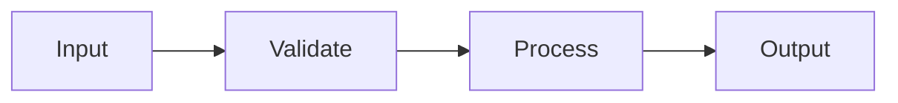

# pydev-feature: Feature Implementation Workflow

execute 6-step structured feature development process.

## when to apply this skill

- user says "implement [feature]", "build [component]", "add [functionality]"
- invoked by pydev-workflow during step 07 (implementation)
- user provides a todo list with major/mid-level/minor tasks
- user says "run pydev-feature for this todo"
- user mentions specific pydev-feature steps (task analysis, design, implementation, testing, integration, cleanup)
- user asks to add tests, integrate code, or cleanup implementation

## workflow entry points

can start at different steps based on context:

| entry point | trigger phrases | context signals |
|-------------|----------------|-----------------|
| step 01 (task analysis) | "implement [feature]", "build [component]" | new feature, unclear scope |
| step 02 (design) | "design this", "plan implementation" | scope clear, need implementation approach |
| step 03 (implementation) | "code this", "write the code", design provided | ready to write code |
| step 04 (testing) | "add tests for", "test this code" | code exists, needs tests |
| step 05 (integration) | "connect this", "integrate [feature]" | tested code needs wiring |
| step 06 (cleanup) | "clean up", "document this" | working feature needs polish |

## core principles

### always read CLAUDE.md first
check project root for CLAUDE.md - contains project-specific best practices and patterns.

### 80% certainty rule
- **above 80% certain**: execute autonomously, document decisions
- **below 80% certain**: stop, explain uncertainty, ask specific questions

### git requirements
- **email**: isa.lucia.sch@gmail.com
- **user**: luvisaisa
- **branch**: main
- **commit triggers**:
  - mid-level task completion: commit implementation
  - major task completion: push to remote
  - test completion: commit tests
  - integration complete: commit integration
  - cleanup complete: commit docs

### code conventions
- comments always lowercase, no emojis
- type hints always required (python)
- follow existing patterns in codebase
- one concept per file (~300 lines max)

### documentation practices
- update existing files, do not create new ones without asking
- timestamp documentation updates
- maintain DEV_LOG.md with feature summaries
- update ARCHITECTURE.md if architecture changes
- update IMPLEMENTATION_PLAN.md progress if part of pydev-workflow

## todo list format

hierarchical structure with 3 levels:

```markdown
## TODO: [Feature/Component Name]

Refs: IMPLEMENTATION_PLAN.md Section [X.X]

* Major Task: [High-level goal]
   * Mid-level Task: [Concrete deliverable]
      * Minor task: [Specific action]
      * Minor task: [Specific action]
   * Mid-level Task: [Concrete deliverable]
      * Minor task: [Specific action]
```

| level | scope | commit trigger |
|-------|-------|----------------|
| major task | feature or component | commit after all mid-level tasks complete |
| mid-level task | concrete deliverable | commit after completion |
| minor task | specific action | part of mid-level commit |

## 6-step workflow

### step 01: task analysis
**id**: `01-task-analysis`
**output**: task analysis (inline or document for complex features)
**checkpoint**: only if below 80% certainty
**commit**: `docs: task analysis for [feature]` (if document created)

understand scope, map dependencies, identify risks.

**actions**:
1. read CLAUDE.md for project patterns
2. read ARCHITECTURE.md to understand system
3. read IMPLEMENTATION_PLAN.md if part of pydev-workflow
4. parse todo into discrete work units
5. identify files to create/modify
6. map dependencies on existing components
7. identify risks and edge cases
8. verify alignment with existing architecture

**80% certainty check**:
- do i understand what needs to be built?
- do i know where it fits in the codebase?
- are dependencies clear?
- are edge cases identified?

if any answer uncertain, ask before proceeding.

**output format** (inline for simple, document for complex):
```
[STEP 1/6] TASK ANALYSIS

scope: [what needs to be built]

files affected:
| file | action | reason |
|------|--------|--------|
| [path] | CREATE/MODIFY | [why] |

dependencies:
| dependency | status | notes |
|------------|--------|-------|
| [component] | exists/needs creation | [notes] |

risks/edge cases:
| risk | impact | mitigation |
|------|--------|------------|
| [description] | high/med/low | [how to handle] |

implementation sequence:
1. [first thing to build]
2. [second thing]
3. [third thing]
```

**use slash commands**:
- `/find-usages` to find usage of related code
- `/explain` to understand existing components
- `/trace` to trace execution paths

### step 02: feature design
**id**: `02-design`
**output**: design notes (inline or document for complex features)
**checkpoint**: only if below 80% certainty or complex design
**commit**: `docs: feature design for [feature]` (if document created)

plan implementation approach before writing code.

**actions**:
1. review task analysis
2. design component structure
3. define function/class signatures
4. plan error handling approach
5. identify test scenarios
6. verify consistency with existing patterns (check CLAUDE.md)
7. create design with interfaces and data flow

**80% certainty check**:
- is design consistent with existing architecture?
- are interfaces clear and complete?
- is error handling comprehensive?

**output format**:
```
[STEP 2/6] FEATURE DESIGN

approach: [high-level implementation strategy]

components:
| component | purpose | location | dependencies |
|-----------|---------|----------|--------------|
| [name] | [what it does] | [file path] | [what it needs] |

interfaces:
```python
def function_name(param: Type) -> ReturnType:
    """brief description."""
```

data flow:


test scenarios:
| scenario | input | expected output |
|----------|-------|-----------------|
| happy path | [input] | [output] |
| edge case | [input] | [output] |
| error case | [input] | [error] |
```

**use slash commands**:
- `/explain` to understand patterns to follow
- `/refactor-plan` if refactoring is needed

### step 03: implementation
**id**: `03-implementation`
**output**: source files
**commit**: after each mid-level task completion
**push**: after major task completion

write the code following the design.

**actions**:
1. implement each work unit in sequence per todo
2. follow existing code patterns from codebase
3. add docstrings and comments (lowercase, no emojis)
4. verify types with mypy after each file
5. format with ruff after changes
6. commit after each mid-level task completion
7. push after major task completion

**progress format**:
```
[STEP 3/6] IMPLEMENTATION

[IMPL] path/to/file.py
  action: CREATE
  status: COMPLETE
  summary: implemented [what was done]

[IMPL] path/to/other.py
  action: MODIFY
  status: COMPLETE
  summary: added [what was added]

mid-level task complete: [task name]
✓ committed: feat: [component] - [what was implemented]
```

**comment style** (always lowercase, no emojis):
```python
# validate input before processing
def process_data(input: DataType) -> Result:
    """
    process the input data and return result.

    args:
        input: the data to process

    returns:
        processed result
    """
    # check for empty input
    if not input:
        return None

    # transform and return
    return transform(input)
```

**commit after each mid-level task**:
```bash
git add [files]
git commit -m "feat: [component] - [what was implemented]"
```

**push after major task**:
```bash
git push origin main
```

**use slash commands**:
- `/new-model` for creating sqlalchemy models
- `/new-endpoint` for creating api endpoints
- `/new-service` for creating service modules
- `/new-adapter` for creating data adapters
- `/new-component` for creating react components
- `/fix-types` to fix type errors
- `/fix-lint` to fix linting issues
- `/fix-imports` to organize imports

### step 04: testing
**id**: `04-testing`
**output**: test files, passing tests
**commit**: `test: [component] - [what was tested]`
**push**: after test commit

write and run tests for the implementation.

**actions**:
1. write tests for each component (follow TEST_STRATEGY.md if exists)
2. include happy path, edge cases, error handling
3. run tests with coverage
4. fix failures (up to 3 auto-retry attempts)
5. verify coverage is acceptable
6. commit tests
7. push to remote

**test output format**:
```
[STEP 4/6] TESTING

[TEST] [component]

test_happy_path ........................ PASS
test_edge_case ......................... PASS
test_error_handling .................... PASS
test_integration ....................... PASS

----------------------------------------
SUMMARY: 4 passed / 0 failed / 0 skipped
----------------------------------------

coverage: [X]% lines, [Y]% branches
```

**if failures occur**:
```
test_edge_case ......................... FAIL
  expected: [expected value]
  actual: [actual value]

[FIX ATTEMPT 1/3]
  analysis: [what went wrong]
  fix: [what was changed]

[RETRY] test_edge_case ................. PASS
```

**if failures persist after 3 attempts**: stop, report issue, ask for guidance.

**commit**:
```bash
git add tests/
git commit -m "test: [component] - [what was tested]"
git push origin main
```

**use slash commands**:
- `/test-generate` to generate comprehensive test suites
- `/test-edge-cases` to generate edge case tests
- `/test` to run tests with coverage
- `/verify` to run full verification suite

### step 05: integration
**id**: `05-integration`
**output**: integrated feature
**commit**: `feat: integrate [feature] with [system component]`
**push**: after integration commit

connect new code to existing system.

**actions**:
1. update imports and module wiring
2. connect to existing components per ARCHITECTURE.md
3. update registries or factories if needed
4. run broader test suite for regression check
5. verify feature works in full system context
6. fix any integration issues
7. commit integration
8. push to remote

**output format**:
```
[STEP 5/6] INTEGRATION

connections made:
| from | to | how |
|------|-----|-----|
| [new component] | [existing component] | [import/call/event] |

updated files:
| file | change |
|------|--------|
| [path] | [what was updated] |

regression check:
  running full test suite...

  ----------------------------------------
  SUMMARY: [X] passed / [Y] failed / [Z] skipped
  ----------------------------------------

  [if failures, list and explain]
```

**commit**:
```bash
git add .
git commit -m "feat: integrate [feature] with [system component]"
git push origin main
```

**use slash commands**:
- `/test` to run integration tests
- `/verify` to run full verification suite
- `/debug` if integration issues occur
- `/find-usages` to verify all connections

### step 06: cleanup and documentation
**id**: `06-cleanup`
**output**: clean, documented code
**commit**: `docs: [feature] implementation complete - dev log updated`
**push**: after cleanup commit

polish code and update documentation.

**actions**:
1. review code for clarity (small refactoring only)
2. ensure all docstrings complete (lowercase comments)
3. update ARCHITECTURE.md if new components added (timestamped)
4. add entry to DEV_LOG.md with implementation summary
5. update IMPLEMENTATION_PLAN.md progress if part of pydev-workflow
6. final lint/format pass
7. commit documentation
8. push to remote

**do not create new documentation files** - update existing ones.

**update ARCHITECTURE.md** (if architecture changed):
```markdown
## [Relevant Section]

> Last updated: [YYYY-MM-DD]

[add new component/flow documentation with mermaid diagrams]
```

**add DEV_LOG.md entry**:
```markdown
### [YYYY-MM-DD] [Feature Name] Implemented {#feature-id}

**summary**: [what was accomplished]

**changes**:
| component | change |
|-----------|--------|
| [component] | [what changed] |

**files added/modified**:
| file | action | purpose |
|------|--------|---------|
| [path] | CREATE/MODIFY | [why] |

**decisions made**:
| decision | rationale |
|----------|-----------|
| [decision] | [why] |

**test coverage**: [X]% lines

**next steps**:
- [follow-up tasks if any]

---
```

**final output**:
```
[STEP 6/6] CLEANUP AND DOCUMENTATION

refactoring: [changes made or "none needed"]

documentation updated:
| document | section | change |
|----------|---------|--------|
| ARCHITECTURE.md | [section] | [what was added] |
| DEV_LOG.md | entries | added implementation summary |
| IMPLEMENTATION_PLAN.md | [unit] | marked complete |

lint/format: PASS

✅ feature complete: [feature name]
```

**final commit**:
```bash
git add .
git commit -m "docs: [feature] implementation complete - dev log updated"
git push origin main
```

**use slash commands**:
- `/document` to generate or update documentation
- `/architecture-sync` to sync architecture with codebase
- `/fix-lint`, `/fix-types`, `/fix-imports` for final cleanup
- `/verify` for final verification

## context-aware execution

analyze user messages for workflow adjustments:

| user input | skill action |
|------------|--------------|
| "skip the design" | jump directly to step 03 (implementation) |
| "just write tests" | jump to step 04 (testing) |
| "analyze this first" | execute step 01 only, wait for approval |
| "implement this todo" | start at step 01, proceed through step 06 |
| "continue" | resume from last completed step |
| "go back to [step]" | return to specified step |
| "pause" | stop and checkpoint current progress |

## progress tracking

```
[pydev-feature PROGRESS]

feature: [feature name]
refs: IMPLEMENTATION_PLAN.md Section [X.X]

✅ 01: task analysis - scope and dependencies mapped
✅ 02: feature design - components and interfaces defined
✅ 03: implementation - code complete
🔄 04: testing - 3/5 test scenarios complete
⏸️  05: integration - pending
⏸️  06: cleanup - pending

commits:
- feat: [component] - [description]
- feat: [component] - [description]
- test: [component] - [description]
```

## integration with pydev-workflow

when invoked by pydev-workflow during step 07:

1. receive unit todo from IMPLEMENTATION_PLAN.md
2. execute steps 01-06 for the unit
3. update IMPLEMENTATION_PLAN.md progress
4. return control to pydev-workflow
5. pydev-workflow proceeds to next unit or step

## file operations guidance

prefer existing files:
- **always** edit existing code files when possible
- **create** new files only when:
  - implementing new components/modules
  - adding tests for new code
  - scaffolding requires new structure

avoid:
- creating new documentation files without asking
- duplicating existing functionality
- over-engineering simple features

## automatic command usage

during implementation, automatically use relevant commands:

| task type | auto-use command |
|-----------|-----------------|
| creating sqlalchemy model | `/new-model` |
| creating api endpoint | `/new-endpoint` |
| creating service module | `/new-service` |
| creating data adapter | `/new-adapter` |
| creating react component | `/new-component` |
| generating tests | `/test-generate` |
| analyzing bugs | `/debug` |
| finding code usages | `/find-usages` |
| before committing | `/verify` |

## quick reference

### git config
```bash
git config user.email "isa.lucia.sch@gmail.com"
git config user.name "luvisaisa"
```

### commit types
- `feat:` - new feature implementation
- `fix:` - bug fix
- `test:` - test changes
- `refactor:` - code refactoring
- `docs:` - documentation changes

### comment rules
- always lowercase
- never use emojis
- be concise and clear

### 80% rule
- above 80% certain: execute, document decisions
- below 80% certain: stop, ask specific questions
