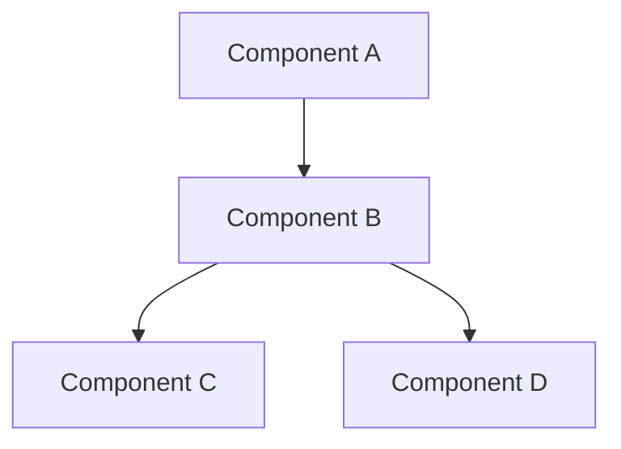
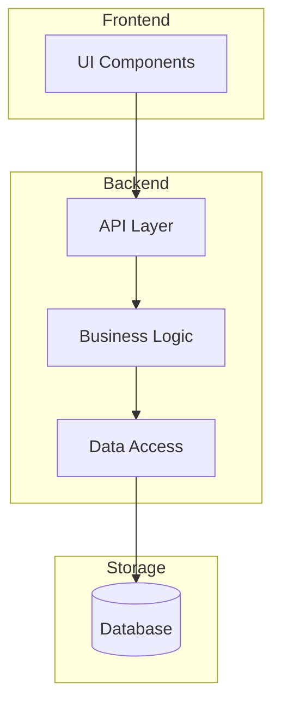
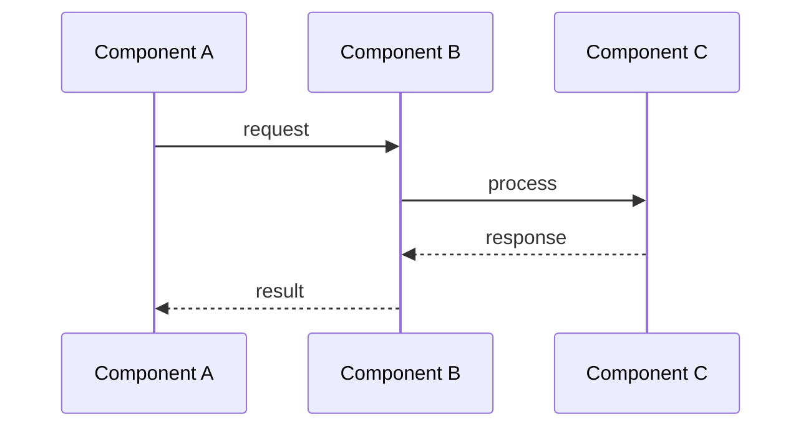
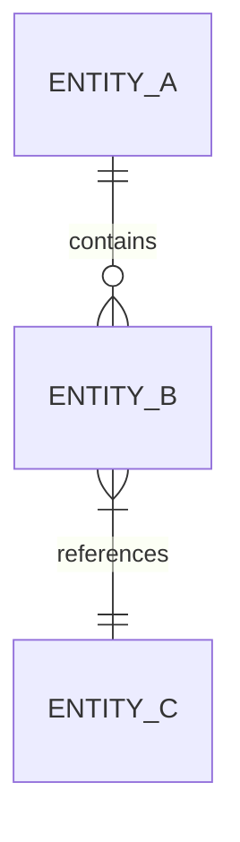
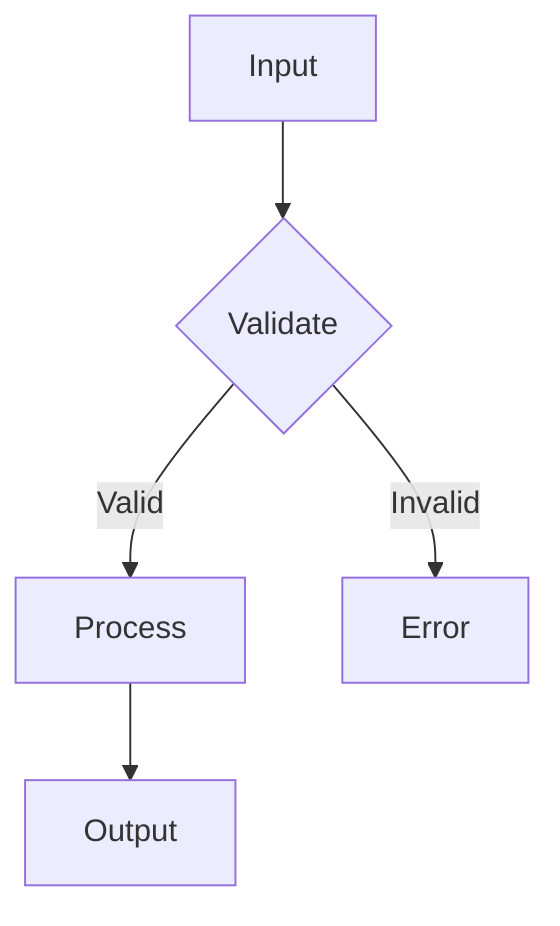
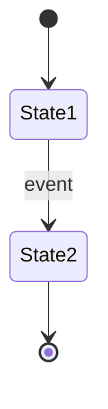
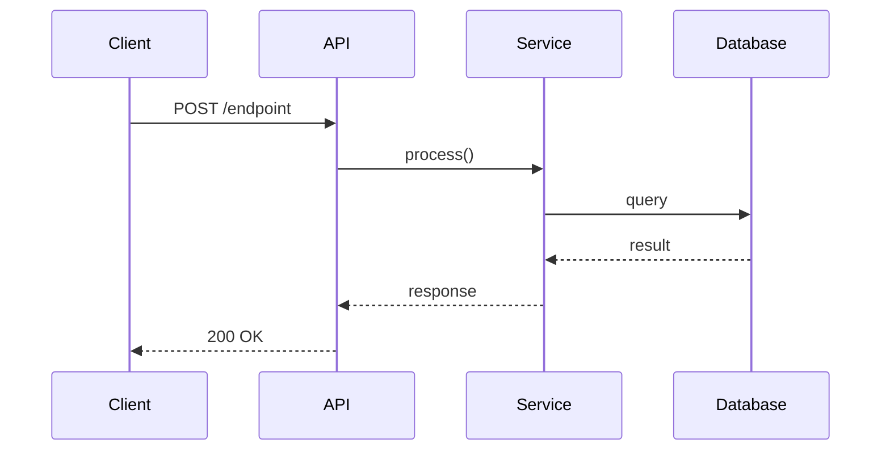

# pydev-workflow: Master Index

> **Version**: 1.0  
> **Workflows**: pydev-workflow (project level), pydev-feature (feature level)

---

## Core Operating Principles

### Always Refer to CLAUDE.md

Before starting any work, read `CLAUDE.md` in the project root for:
- Project-specific best practices
- Coding conventions
- Architecture decisions
- Current focus and context

CLAUDE.md is the source of truth for how to work in this project.

### The 80% Certainty Rule

Claude Code operates autonomously when **80% or more certain** that actions align with project goals. When certainty drops below 80%, Claude stops and asks clarifying questions before proceeding.

**Above 80% certainty**: Execute autonomously, document decisions made
**Below 80% certainty**: Stop, explain uncertainty, ask specific questions

This applies to:
- Architectural decisions within approved designs
- Implementation choices
- Refactoring decisions
- Test coverage scope
- Documentation depth

### Git Commit Requirements

**Commit frequently and meaningfully under**:
- Email: isa.lucia.sch@gmail.com
- User: luvisaisa
- Branch: main (unless otherwise specified)

**Always configure before first commit**:
```bash
git config user.email "isa.lucia.sch@gmail.com"
git config user.name "luvisaisa"
```

**Commit triggers**:

| Event | Commit Required | Message Format |
|-------|-----------------|----------------|
| Planning document created/updated | Yes | `docs: [document name] - [what was defined]` |
| Implementation plan approved | Yes | `plan: [feature/component] implementation plan` |
| Any meaningful code implementation | Yes | `feat: [component] - [what was implemented]` |
| Bug fix | Yes | `fix: [component] - [what was fixed]` |
| Test added/updated | Yes | `test: [component] - [what was tested]` |
| Refactor | Yes | `refactor: [component] - [what changed]` |
| Documentation update | Yes | `docs: [what was documented]` |
| Config change | Yes | `config: [what was configured]` |

**Push frequency**: Push to main after every commit unless batching related micro-changes (batch limit: 3 commits before push)

**Commit message format**:
```
<type>: <component> - <short description>

<optional body explaining why, not what>

Refs: <relevant doc or issue>
```

### Documentation Practices

**Consolidate, do not proliferate**:
- Always update existing relevant documentation files rather than creating new ones
- Before creating a new documentation file, ask and evaluate if it is necessary for organization
- All documentation changes must be timestamped
- New implementation must be properly explained and connected to its relevant existing file

**Timestamp format for documentation updates**:
```markdown
## [Section Name]

> Last updated: [YYYY-MM-DD]

[Content]
```

**DEV_LOG.md** (required):

Maintain a dev log with comprehensive post-implementation summaries. Structure:

```markdown
# Development Log

## Table of Contents

| Date | Entry | Link |
|------|-------|------|
| [YYYY-MM-DD] | [Title] | [#entry-id](#entry-id) |
| [YYYY-MM-DD] | [Title] | [#entry-id](#entry-id) |

---

## Entries

### [YYYY-MM-DD] [Title] {#entry-id}

**Summary**: [What was accomplished]

**Changes**:
- [Component]: [What changed]
- [Component]: [What changed]

**Decisions Made**:
- [Decision]: [Rationale]

**Next Steps**:
- [What comes next]

---
```

**Commit after every dev log update**: `docs: dev log - [entry title]`

**Use Mermaid.js for visuals**:

All diagrams, charts, flowcharts, and visual documentation must use Mermaid.js syntax:

```markdown
## System Architecture


```

**Mermaid diagram types to use**:
- `flowchart` - System architecture, data flow, process flows
- `sequenceDiagram` - API interactions, request/response flows
- `erDiagram` - Database schemas, entity relationships
- `classDiagram` - Class hierarchies, type systems
- `stateDiagram-v2` - State machines, status flows
- `gantt` - Implementation timelines, project planning

**Tables over bullets for structured data**:

Use markdown tables instead of bullet lists when presenting structured information:

```markdown
| Component | Role | Status |
|-----------|------|--------|
| Parser | Handles input | Complete |
| Processor | Transforms data | In progress |
```

### Code Comment Formatting

**All comments must be lowercase. No exceptions.**

```python
# correct: lowercase comment explaining the logic
def process_data(input):
    # validate input before processing
    if not input:
        return None
    
    # transform and return
    return transform(input)
```

```python
# INCORRECT: Do Not Use Title Case Or UPPERCASE In Comments
def process_data(input):
    # This Is Wrong
    # SO IS THIS
    return transform(input)
```

**Never use emojis in code comments.**

```python
# correct: clean comment
def validate():
    pass

# incorrect: no emojis allowed
def validate():  # ✅ validates input
    pass
```

---

## Workflow Hierarchy

```
pydev-workflow (Project Level)
    |
    |-- 01-project-init
    |-- 02-system-architecture  
    |-- 03-data-models
    |-- 04-core-logic
    |-- 05-interfaces
    |-- 06-impl-plan
    |-- 07-implementation -----> [triggers pydev-feature per unit]
    |-- 08-test-strategy
    |-- 09-test-impl
    |-- 10-integration
    |-- 11-documentation
    |-- 12-deployment
    
pydev-feature (Feature Level)
    |
    |-- 01-task-analysis
    |-- 02-design
    |-- 03-implementation
    |-- 04-testing
    |-- 05-integration
    |-- 06-cleanup
```

---

## TODO List Format

When Claude generates a TODO list for implementation, use this hierarchical format:

```markdown
## TODO: [Feature/Component Name]

Refs: IMPLEMENTATION_PLAN.md Section [X.X]

* Major Task: [High-level goal]
   * Mid-level Task: [Concrete deliverable]
      * Minor task: [Specific action]
      * Minor task: [Specific action]
   * Mid-level Task: [Concrete deliverable]
      * Minor task: [Specific action]
      * Minor task: [Specific action]
      * Minor task: [Specific action]

* Major Task: [High-level goal]
   * Mid-level Task: [Concrete deliverable]
      * Minor task: [Specific action]
```

**Hierarchy definitions**:

| Level | Scope | Example | Commit Trigger |
|-------|-------|---------|----------------|
| Major Task | Feature or component | "Implement user authentication" | Commit after all mid-level tasks complete |
| Mid-level Task | Concrete deliverable | "Create login endpoint" | Commit after completion |
| Minor Task | Specific action | "Add password validation" | Part of mid-level commit |

**Example**:
```markdown
## TODO: Keyword Extraction System

Refs: IMPLEMENTATION_PLAN.md Section 4.2

* Major Task: Build keyword extraction engine
   * Mid-level Task: Create base extractor class
      * Minor task: Define abstract interface
      * Minor task: Implement shared utilities
      * Minor task: Add logging hooks
   * Mid-level Task: Implement stop word filtering
      * Minor task: Load default stop word list
      * Minor task: Add custom stop word support
      * Minor task: Create filter pipeline
   * Mid-level Task: Build relevance scoring
      * Minor task: Implement TF-IDF calculation
      * Minor task: Add position weighting
      * Minor task: Create score normalization

* Major Task: Integrate with document processor
   * Mid-level Task: Add extraction hook to pipeline
      * Minor task: Define extraction trigger point
      * Minor task: Wire up extractor instance
   * Mid-level Task: Store extracted keywords
      * Minor task: Create database insert logic
      * Minor task: Handle duplicate detection
```

---

## pydev-workflow: Project Level Steps

### Step 01: Project Initialization

**ID**: `01-project-init`  
**Purpose**: Establish goals, scope, constraints, high-level architecture  
**Output**: `PROJECT_FOUNDATION.md`  
**Checkpoint**: Approve foundation before design work  
**Commit**: `docs: PROJECT_FOUNDATION.md - initial project definition`

---

### Step 02: System Architecture

**ID**: `02-system-architecture`  
**Purpose**: Define components, boundaries, communication patterns  
**Input**: `PROJECT_FOUNDATION.md`  
**Output**: `ARCHITECTURE.md`

**Actions**:
1. Read PROJECT_FOUNDATION.md
2. Design component structure
3. Define component responsibilities and boundaries
4. Map communication patterns (sync/async, protocols)
5. Identify shared infrastructure (logging, config, errors)
6. Create architecture diagram

**Output Structure**:
```markdown
# System Architecture

> Last updated: [YYYY-MM-DD]

## Component Map



## Components

### [Component Name]

| Attribute | Value |
|-----------|-------|
| Responsibility | [single responsibility] |
| Boundaries | [what it owns, what it does not touch] |
| Dependencies | [what it needs] |
| Dependents | [what needs it] |
| Communication | [how it talks to other components] |

## Communication Patterns



| From | To | Method | Format |
|------|----|--------|--------|
| [A] | [B] | [sync/async/event] | [JSON/protobuf/etc] |

## Shared Infrastructure

| Concern | Approach |
|---------|----------|
| Logging | [approach] |
| Configuration | [approach] |
| Error handling | [approach] |

## Deployment Units

| Unit | Contains | Scaling |
|------|----------|---------|
| [unit] | [components] | [strategy] |
```

**Checkpoint**: Approve component structure  
**Commit**: `docs: ARCHITECTURE.md - system architecture defined`  
**Then**: Update DEV_LOG.md with architecture summary

---

### Step 03: Data Models

**ID**: `03-data-models`  
**Purpose**: Define entities, relationships, storage strategy  
**Input**: `PROJECT_FOUNDATION.md`, `ARCHITECTURE.md`  
**Output**: Update `ARCHITECTURE.md` with data models section

**Actions**:
1. Identify all entities from architecture
2. Define entity attributes and types
3. Map relationships (1:1, 1:N, N:M)
4. Choose storage approach per entity
5. Design indexes and query patterns
6. Add to ARCHITECTURE.md under "Data Models" section
7. Update DEV_LOG.md with summary

**Add to ARCHITECTURE.md**:
```markdown
## Data Models

> Last updated: [YYYY-MM-DD]

### Entity Relationship Diagram



### Entities

#### [Entity Name]

**Storage**: [PostgreSQL/Redis/file/etc]

| Field | Type | Constraints | Notes |
|-------|------|-------------|-------|
| id | UUID | PK | |
| [field] | [type] | [constraints] | [notes] |

**Indexes**:
| Index | Fields | Purpose |
|-------|--------|---------|
| [name] | [fields] | [why] |

### Query Patterns

| Query | Frequency | Index Used |
|-------|-----------|------------|
| [description] | [high/med/low] | [index] |
```

**Checkpoint**: Approve data structures  
**Commit**: `docs: ARCHITECTURE.md - data models added`

---

### Step 04: Core Logic Design

**ID**: `04-core-logic`  
**Purpose**: Define algorithms, business rules, processing flows  
**Input**: `PROJECT_FOUNDATION.md`, `ARCHITECTURE.md`  
**Output**: Update `ARCHITECTURE.md` with core logic section

**Actions**:
1. Identify core algorithms needed
2. Define business rules and validation logic
3. Design processing flows and state machines
4. Create type system (if applicable)
5. Define computed properties and derived data
6. Add to ARCHITECTURE.md under "Core Logic" section
7. Update DEV_LOG.md with summary

**Add to ARCHITECTURE.md**:
```markdown
## Core Logic

> Last updated: [YYYY-MM-DD]

### Processing Flows

#### [Flow Name]



**Trigger**: [what initiates this flow]
**Input**: [what it receives]
**Output**: [what it produces]

### Business Rules

| Rule | Condition | Action | Priority |
|------|-----------|--------|----------|
| [name] | [when] | [what] | [order] |

### Algorithms

#### [Algorithm Name]

**Purpose**: [what it computes]
**Complexity**: O([time]) / O([space])

```python
# pseudocode or signature
def algorithm(input: Type) -> Output:
    ...
```

### State Machines (if applicable)


```

**Checkpoint**: Approve logic approach  
**Commit**: `docs: ARCHITECTURE.md - core logic added`

---

### Step 05: Interface Design

**ID**: `05-interfaces`  
**Purpose**: Define APIs, contracts, input/output shapes  
**Input**: All previous sections of ARCHITECTURE.md  
**Output**: Update `ARCHITECTURE.md` with interfaces section

**Actions**:
1. Define all public interfaces (APIs, CLIs, events)
2. Specify request/response shapes
3. Define error responses and codes
4. Document authentication/authorization
5. Add to ARCHITECTURE.md under "Interfaces" section
6. Update DEV_LOG.md with summary

**Add to ARCHITECTURE.md**:
```markdown
## Interfaces

> Last updated: [YYYY-MM-DD]

### API Overview

**Base URL**: [url]
**Auth**: [method]
**Version**: [strategy]

### Endpoints

#### [GROUP]

##### [METHOD] [PATH]

**Purpose**: [what it does]

**Request**:
```json
{
  "field": "type - description"
}
```

**Response** (200):
```json
{
  "field": "type - description"
}
```

**Errors**:
| Code | Meaning | Response |
|------|---------|----------|
| 400 | [reason] | [shape] |

### Request/Response Flow



### Event Contracts (if applicable)

| Event | Trigger | Payload |
|-------|---------|---------|
| [name] | [when] | [shape] |

### CLI Interface (if applicable)

| Command | Usage | Description |
|---------|-------|-------------|
| [cmd] | `program cmd [opts]` | [what it does] |
```

**Checkpoint**: Approve public interfaces  
**Commit**: `docs: ARCHITECTURE.md - interfaces added`

---

### Step 06: Implementation Plan

**ID**: `06-impl-plan`  
**Purpose**: Break designs into buildable units with sequence  
**Input**: All previous documents  
**Output**: `IMPLEMENTATION_PLAN.md`

**Actions**:
1. Break system into implementation units
2. Define dependencies between units
3. Sequence units respecting dependencies
4. Estimate complexity per unit
5. Identify parallelizable work
6. Create TODO lists per unit using standard format

**Output Structure**:
```markdown
# Implementation Plan

## Overview

**Total Units**: [N]
**Estimated Complexity**: [Low/Medium/High]
**Critical Path**: [sequence of blocking units]

## Implementation Sequence

```
[Unit 1] -> [Unit 2] -> [Unit 3]
                    \-> [Unit 4] (parallel)
```

## Units

### Unit 1: [Name]

**Priority**: [1-N]
**Depends on**: [units or "none"]
**Blocks**: [units or "none"]
**Complexity**: [Low/Medium/High]
**Estimated scope**: [files/functions]

**TODO**:

* Major Task: [goal]
   * Mid-level Task: [deliverable]
      * Minor task: [action]
      * Minor task: [action]

**Acceptance criteria**:
- [ ] [criterion]
- [ ] [criterion]

---

### Unit 2: [Name]
...

## Risk Register

| Risk | Impact | Likelihood | Mitigation |
|------|--------|------------|------------|
| [risk] | [H/M/L] | [H/M/L] | [plan] |
```

**Checkpoint**: Approve build sequence  
**Commit**: `plan: IMPLEMENTATION_PLAN.md - implementation plan complete`

---

### Step 07: Implementation

**ID**: `07-implementation`  
**Purpose**: Build the system following the plan  
**Input**: `IMPLEMENTATION_PLAN.md`, all design docs  
**Output**: Source code  
**Triggers**: `pydev-feature` for each unit

**Actions**:
1. For each unit in sequence:
   - Run pydev-feature workflow
   - Complete all TODO items
   - Commit after each mid-level task
   - Push after each major task
2. Track progress against plan
3. Flag deviations from plan

**Progress Format**:
```
[IMPLEMENTATION PROGRESS]

Unit 1: [Name] .................. COMPLETE
  Commits: [list of commits]
  
Unit 2: [Name] .................. IN PROGRESS
  * Major Task 1 ................ COMPLETE
  * Major Task 2 ................ IN PROGRESS
     * Mid-level Task 2.1 ....... COMPLETE
     * Mid-level Task 2.2 ....... IN PROGRESS
        * Minor task a .......... DONE
        * Minor task b .......... WORKING
        * Minor task c .......... PENDING
        
Unit 3: [Name] .................. PENDING
```

**Checkpoint**: Review at unit completion  
**Commit**: Per mid-level task completion

---

### Step 08: Test Strategy

**ID**: `08-test-strategy`  
**Purpose**: Define testing approach and coverage targets  
**Input**: All design docs, implementation  
**Output**: `TEST_STRATEGY.md`

**Actions**:
1. Define test categories (unit, integration, e2e)
2. Set coverage targets
3. Identify critical paths requiring thorough testing
4. Plan test data strategy
5. Define test environments

**Output Structure**:
```markdown
# Test Strategy

## Coverage Targets

| Category | Target | Current | Notes |
|----------|--------|---------|-------|
| Unit | [X]% | - | |
| Integration | [X]% | - | |
| E2E | [critical paths] | - | |

## Test Categories

### Unit Tests

**Scope**: [what they cover]
**Location**: [where they live]
**Naming**: [convention]

**Priority areas**:
1. [area]: [why critical]
2. [area]: [why critical]

### Integration Tests

**Scope**: [what they cover]
**Dependencies**: [external services, mocks]

### E2E Tests

**Scope**: [critical user flows]
**Environment**: [where they run]

## Test Data

**Strategy**: [fixtures/factories/snapshots]
**Location**: [where test data lives]
**Sensitive data**: [how handled]

## CI Integration

[How tests run in CI]
```

**Checkpoint**: Approve test approach  
**Commit**: `docs: TEST_STRATEGY.md - test strategy defined`

---

### Step 09: Test Implementation

**ID**: `09-test-impl`  
**Purpose**: Write tests following strategy  
**Input**: `TEST_STRATEGY.md`, source code  
**Output**: Test files  
**Triggers**: `pydev-feature` for test implementation

**Actions**:
1. Create test structure
2. Write unit tests for critical paths first
3. Write integration tests
4. Run full suite, report coverage
5. Fill coverage gaps

**Progress Format**:
```
[TEST IMPLEMENTATION]

Unit Tests:
  [component]: [X] tests, [Y]% coverage
  [component]: [X] tests, [Y]% coverage
  
Integration Tests:
  [flow]: [X] tests
  
Coverage Report:
  Lines: [X]%
  Branches: [X]%
  Functions: [X]%
```

**Checkpoint**: Review coverage  
**Commit**: `test: [component] - [what was tested]`

---

### Step 10: Integration and Refinement

**ID**: `10-integration`  
**Purpose**: Connect components, verify system works end-to-end  
**Input**: All implementation and tests  
**Output**: Integrated system

**Actions**:
1. Verify all components connect properly
2. Run integration test suite
3. Identify and fix integration gaps
4. Performance check on critical paths
5. Refactor for consistency

**Checkpoint**: Approve integration  
**Commit**: `refactor: integration cleanup and verification`

---

### Step 11: Documentation

**ID**: `11-documentation`  
**Purpose**: Finalize user and developer documentation  
**Input**: All previous outputs  
**Output**: Updated `README.md`, consolidated docs

**Actions**:
1. Write/update README with quick start
2. Ensure ARCHITECTURE.md is complete and current
3. Verify all mermaid diagrams render correctly
4. Add inline code comments where helpful (lowercase, no emojis)
5. Update DEV_LOG.md with documentation summary
6. Evaluate if any additional docs/ files are needed (ask before creating)

**README.md structure**:
```markdown
# [Project Name]

[One paragraph description]

## Quick Start

```bash
# installation and basic usage
```

## Architecture

See [ARCHITECTURE.md](ARCHITECTURE.md) for detailed system design.

```mermaid
flowchart LR
    [simplified overview diagram]
```

## Development

### Setup
[How to set up dev environment]

### Testing
[How to run tests]

### Contributing
[Guidelines]

## Documentation

| Document | Purpose |
|----------|---------|
| ARCHITECTURE.md | System design, data models, interfaces |
| IMPLEMENTATION_PLAN.md | Build sequence and progress |
| DEV_LOG.md | Development timeline and decisions |
| TEST_STRATEGY.md | Testing approach |
```

**Checkpoint**: Review docs  
**Commit**: `docs: README.md - documentation finalized`

---

### Step 12: Deployment Prep

**ID**: `12-deployment`  
**Purpose**: Prepare for deployment  
**Input**: Complete system  
**Output**: Deployment config, CI/CD

**Actions**:
1. Create/update Dockerfile (if applicable)
2. Define environment variables
3. Set up CI/CD pipeline
4. Create deployment documentation
5. Define rollback procedure

**Checkpoint**: Approve deployment strategy  
**Commit**: `config: deployment configuration`

---

## pydev-feature: Feature Level Steps

Used for implementing specific features within an existing project, or as the inner loop of pydev-workflow Step 07.

### Step 01: Task Analysis

**ID**: `01-task-analysis`  
**Purpose**: Understand scope, map dependencies, identify risks  
**Input**: TODO list, existing codebase  
**Output**: Task analysis (inline or `TASK_ANALYSIS.md` for complex features)

**Actions**:
1. Parse TODO into work units
2. Identify files to create/modify
3. Map dependencies
4. Identify risks and edge cases
5. Verify alignment with existing architecture

**80% Certainty Check**:
- Do I understand what needs to be built?
- Do I know where it fits in the codebase?
- Are dependencies clear?
- Are edge cases identified?

If any answer is uncertain, ask before proceeding.

**Output** (for complex features):
```markdown
# Task Analysis: [Feature Name]

Refs: IMPLEMENTATION_PLAN.md Section [X.X]

## Scope
[What needs to be built]

## Files Affected
| File | Action | Reason |
|------|--------|--------|
| [path] | CREATE/MODIFY | [why] |

## Dependencies
- [dep]: [status]

## Risks
- [risk]: [mitigation]

## Sequence
1. [first]
2. [second]
```

**Checkpoint**: Only if below 80% certainty  
**Commit**: `docs: task analysis for [feature]` (if document created)

---

### Step 02: Feature Design

**ID**: `02-design`  
**Purpose**: Plan implementation approach  
**Input**: Task analysis  
**Output**: Design notes (inline or `FEATURE_DESIGN.md` for complex features)

**Actions**:
1. Design component structure
2. Define interfaces and signatures
3. Plan error handling
4. Identify test scenarios
5. Verify consistency with existing patterns

**80% Certainty Check**:
- Is the design consistent with existing architecture?
- Are interfaces clear?
- Is error handling comprehensive?

**Output** (for complex features):
```markdown
# Feature Design: [Feature Name]

## Approach
[Strategy]

## Components

### [Component]
- Purpose: [what]
- Interface:
  ```python
  def method(param: Type) -> Return:
      """Doc"""
  ```
- Error handling: [approach]

## Test Scenarios
1. [scenario]
2. [scenario]
```

**Checkpoint**: Only if below 80% certainty or design is complex  
**Commit**: `docs: feature design for [feature]` (if document created)

---

### Step 03: Implementation

**ID**: `03-implementation`  
**Purpose**: Write the code  
**Input**: Design, TODO list  
**Output**: Source files

**Actions**:
1. Implement each work unit in sequence
2. Follow existing code patterns
3. Add docstrings and comments
4. Commit after each mid-level task

**Progress Format**:
```
[IMPL] [file path]
  Action: CREATE | MODIFY
  Status: COMPLETE
  Summary: [what was done]
```

**Commit**: After each mid-level task
```bash
git add [files]
git commit -m "feat: [component] - [what was implemented]"
```

---

### Step 04: Testing

**ID**: `04-testing`  
**Purpose**: Write and run tests  
**Input**: Implementation  
**Output**: Test files, passing tests

**Actions**:
1. Write tests for new functionality
2. Run tests
3. Fix failures (up to 3 auto-retry attempts)
4. Verify coverage is acceptable

**Output Format**:
```
[TEST] [component]

test_happy_path .................. PASS
test_edge_case ................... PASS
test_error_handling .............. PASS

SUMMARY: 3 passed / 0 failed

Coverage: [X]% lines
```

**If failures persist after 3 attempts**: Stop and report, ask for guidance

**Commit**: `test: [component] - [what was tested]`

---

### Step 05: Integration

**ID**: `05-integration`  
**Purpose**: Connect to existing system  
**Input**: Tested implementation  
**Output**: Integrated feature

**Actions**:
1. Update imports and wiring
2. Run broader test suite
3. Verify no regressions
4. Check feature works in context

**Output Format**:
```
[INTEGRATION] [feature]

Connections made:
  - [where]: [how]
  
Regression check:
  Full suite: [X] passed / [Y] failed
  
  [If failures, list and explain]
```

**Commit**: `feat: integrate [feature] with [system]`

---

### Step 06: Cleanup

**ID**: `06-cleanup`  
**Purpose**: Polish and document  
**Input**: Integrated feature  
**Output**: Clean, documented code

**Actions**:
1. Review for code clarity
2. Refactor if needed (small improvements only)
3. Ensure docstrings are complete
4. Update relevant documentation
5. Final lint/format

**Output Format**:
```
[CLEANUP] [feature]

Refactoring: [changes or "none needed"]
Docs updated: [list or "none"]
Lint: PASS

Feature complete.
```

**Commit**: `refactor: cleanup [feature]` (if changes made)

**Final Push**:
```bash
git push origin main
```

---

## Workflow Triggers

### Starting pydev-workflow

```
Initialize pydev-workflow for [project name].
```

or

```
Continue pydev-workflow. Read PROJECT_FOUNDATION.md and tell me current status.
```

### Starting pydev-feature

Triggered automatically when:
- TODO list is generated during pydev-workflow Step 07
- User requests feature implementation in existing project

Manual trigger:
```
Run pydev-feature for this TODO:

* Major Task: [goal]
   * Mid-level Task: [deliverable]
      * Minor task: [action]
```

### Resuming Work

```
Continue pydev-workflow. Check PROJECT_FOUNDATION.md and IMPLEMENTATION_PLAN.md for current status.
```

---

## File Structure

```
project/
|-- CLAUDE.md                # best practices and project context (read first, always)
|-- DEV_LOG.md               # timestamped development log with table of contents
|-- PROJECT_FOUNDATION.md    # project definition, updated as scope evolves
|-- ARCHITECTURE.md          # system design, components, data flow (use mermaid)
|-- IMPLEMENTATION_PLAN.md   # build sequence, TODO lists, progress tracking
|-- TEST_STRATEGY.md         # testing approach and coverage
|-- README.md                # user-facing documentation
|-- docs/                    # additional docs only if organization requires
|-- src/                     # source code
|-- tests/                   # test files
```

**Note**: Prefer updating existing files over creating new ones. The above represents the core documentation set. Additional files in `docs/` require justification.

---

## CLAUDE.md Template

The primary reference for project best practices. Read before starting any work.

```markdown
# [Project Name]

## Overview
[One paragraph summary]

## Best Practices

### Code Style
- [Convention 1]
- [Convention 2]
- comments always lowercase, no emojis

### Architecture Patterns
- [Pattern used and why]

### Documentation
- update existing files, do not create new ones without evaluation
- use mermaid.js for all diagrams
- timestamp all documentation changes
- log all implementations in DEV_LOG.md

## Current Status
Workflow: pydev-workflow
Current Step: [step ID]
Last Updated: [date]

## Architecture

```mermaid
flowchart TD
    [component diagram]
```

## Recent Decisions
| Date | Decision | Rationale |
|------|----------|-----------|
| [date] | [decision] | [why] |

## Active TODO
[Current TODO list if mid-implementation]

## Commands
- `[command]`: [what it does]
```

---

## Quick Reference

### Commit Types
- `docs:` - Documentation changes
- `plan:` - Planning documents
- `feat:` - New feature implementation
- `fix:` - Bug fix
- `test:` - Test changes
- `refactor:` - Code refactoring
- `config:` - Configuration changes

### Git Config
```bash
git config user.email "isa.lucia.sch@gmail.com"
git config user.name "luvisaisa"
```

### 80% Rule Summary
- Above 80% certain: Execute, document decisions
- Below 80% certain: Stop, ask specific questions

### Documentation Rules
- Update existing files, do not create new ones without asking
- Use mermaid.js for all diagrams and visuals
- Timestamp all documentation updates
- Log all implementations in DEV_LOG.md
- Comments always lowercase, never emojis
- Always read CLAUDE.md first
