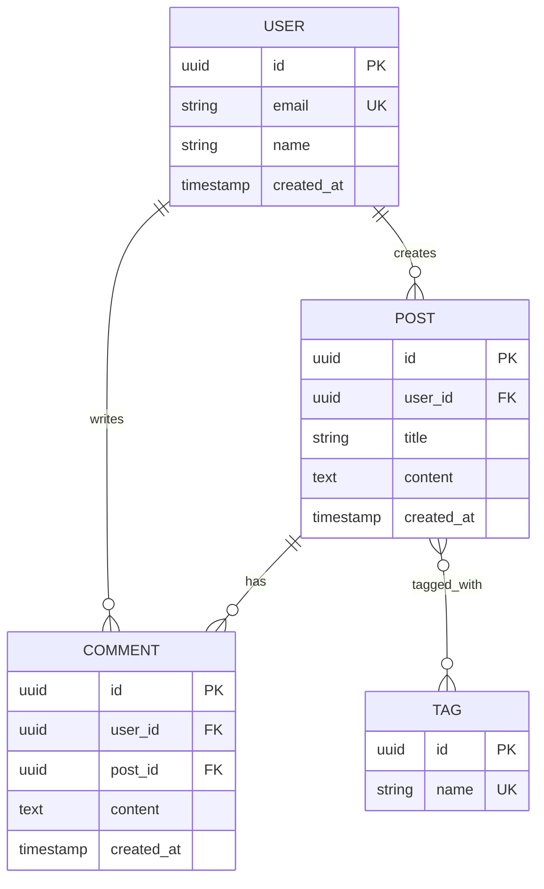

# pydev-workflow: Step 03 — Data Models

> **Workflow**: pydev-workflow  
> **Step**: 03-data-models  
> **Previous**: 02-system-architecture  
> **Next**: 04-core-logic  
> **Output**: `ARCHITECTURE.md` updated (Data Models section), `DEV_LOG.md` updated

---

## Pre-Flight

1. **Read CLAUDE.md** — project best practices
2. **Read ARCHITECTURE.md** — understand component structure
3. **Check DEV_LOG.md** — verify step 02 is complete

---

## Purpose

Define all data entities, their attributes, relationships, storage strategy, and query patterns. Data models are foundational — changes here ripple through the entire system.

---

## 80% Certainty Rule

**Above 80%**: Execute, document decisions  
**Below 80%**: Stop, ask specific questions

---

## Execution

```
[STEP 03] DATA MODELS
```

### Phase 1: Entity Identification

**Actions**:
1. Review ARCHITECTURE.md components
2. Identify all entities each component needs
3. List entity attributes and types
4. Identify relationships between entities

**Entity Discovery Questions**:
- What objects does the system manage?
- What state needs to persist?
- What are the core domain concepts?

---

### Phase 2: Relationship Mapping

| Relationship Type | When to Use |
|-------------------|-------------|
| One-to-One (1:1) | Exclusive ownership, optional extension |
| One-to-Many (1:N) | Parent-child, ownership |
| Many-to-Many (N:M) | Associations, tags, categories |

---

### Phase 3: Storage Strategy

For each entity, decide:

| Factor | Options |
|--------|---------|
| Storage type | Relational DB, Document DB, Key-Value, File |
| Normalization | Normalized (less redundancy) vs Denormalized (faster reads) |
| Indexing | Which fields need indexes for query performance |
| Partitioning | How to split large datasets |

---

### Phase 4: Output

**Update `ARCHITECTURE.md`** — Add Data Models section:

```markdown
## Data Models

> Last updated: [YYYY-MM-DD]

### Entity Relationship Diagram



### Entities

#### [Entity Name]

| Field | Type | Constraints | Description |
|-------|------|-------------|-------------|
| id | UUID | PK | unique identifier |
| [field] | [type] | [constraints] | [description] |
| created_at | TIMESTAMP | NOT NULL, DEFAULT NOW | creation time |
| updated_at | TIMESTAMP | | last modification |

**Relationships**:

| Relationship | Type | Description |
|--------------|------|-------------|
| [Entity] | 1:N | [description] |

**Storage**: [PostgreSQL / MongoDB / etc]

**Indexes**:

| Index Name | Fields | Type | Purpose |
|------------|--------|------|---------|
| idx_[name] | [fields] | [btree/hash/gin] | [why needed] |

---

### Query Patterns

| Query | Frequency | Complexity | Index Used |
|-------|-----------|------------|------------|
| [Get entity by ID] | High | O(1) | PK |
| [List by foreign key] | High | O(log n) | idx_[name] |
| [Search by field] | Medium | O(log n) | idx_[name] |
| [Aggregate query] | Low | O(n) | - |

### Migration Strategy

| Aspect | Approach |
|--------|----------|
| Tool | [alembic, prisma migrate, etc] |
| Versioning | [sequential, timestamp] |
| Rollback | [how handled] |
| Data migrations | [how handled] |

### Database Schema (SQL)

```sql
-- [entity name]
CREATE TABLE [table_name] (
    id UUID PRIMARY KEY DEFAULT gen_random_uuid(),
    [field] [TYPE] [CONSTRAINTS],
    created_at TIMESTAMPTZ NOT NULL DEFAULT NOW(),
    updated_at TIMESTAMPTZ
);

-- indexes
CREATE INDEX idx_[name] ON [table]([fields]);

-- foreign keys
ALTER TABLE [table] 
    ADD CONSTRAINT fk_[name] 
    FOREIGN KEY ([field]) REFERENCES [other_table](id);
```
```

**Update DEV_LOG.md**:

```markdown
### [YYYY-MM-DD] Data Models Defined {#data-models}

**Summary**: Designed data models and storage strategy

**Entities Defined**:

| Entity | Fields | Storage |
|--------|--------|---------|
| [Name] | [count] | [where] |

**Relationships**:

```mermaid
erDiagram
    [simplified ER diagram]
```

**Decisions Made**:

| Decision | Rationale |
|----------|-----------|
| [Storage choice] | [Why] |
| [Normalization level] | [Why] |

**Next Steps**:
- Proceed to core logic design

---
```

---

## Commit

```bash
git add ARCHITECTURE.md DEV_LOG.md
git commit -m "docs: ARCHITECTURE.md - data models defined"
git push origin main
```

---

## Checkpoint

Review data models before proceeding.

**Questions to confirm**:
1. Are all necessary entities captured?
2. Are relationships correctly modeled?
3. Will query patterns perform adequately?
4. Any normalization concerns?

---

## Output Summary

| Output | Action |
|--------|--------|
| ARCHITECTURE.md | Added Data Models section with ERD, entities, indexes, SQL |
| DEV_LOG.md | Added data models entry |
| Git | Committed and pushed |
