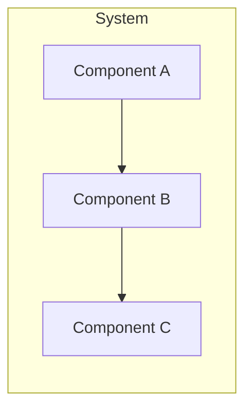

# pydev-workflow: Step 11 — Documentation

> **Workflow**: pydev-workflow  
> **Step**: 11-documentation  
> **Previous**: 10-integration  
> **Next**: 12-deployment  
> **Output**: `README.md` finalized, all docs updated, `DEV_LOG.md` updated

---

## Pre-Flight

1. **Read CLAUDE.md** — project best practices
2. **Review all existing docs** — PROJECT_FOUNDATION.md, ARCHITECTURE.md, etc.
3. **Check DEV_LOG.md** — verify step 10 complete

---

## Purpose

Finalize user-facing and developer documentation. Ensure all docs are current, accurate, and comprehensive.

---

## 80% Certainty Rule

**Above 80%**: Execute, document decisions  
**Below 80%**: Stop, ask specific questions

---

## Execution

```
[STEP 11] DOCUMENTATION
```

### Phase 1: Documentation Audit

**Check each document**:

| Document | Exists | Current | Complete | Action Needed |
|----------|--------|---------|----------|---------------|
| CLAUDE.md | [ ] | [ ] | [ ] | |
| PROJECT_FOUNDATION.md | [ ] | [ ] | [ ] | |
| ARCHITECTURE.md | [ ] | [ ] | [ ] | |
| IMPLEMENTATION_PLAN.md | [ ] | [ ] | [ ] | |
| TEST_STRATEGY.md | [ ] | [ ] | [ ] | |
| DEV_LOG.md | [ ] | [ ] | [ ] | |
| README.md | [ ] | [ ] | [ ] | |

**Do NOT create new documentation files** without explicit need. Update existing files.

---

### Phase 2: README.md Finalization

**Create/Update `README.md`**:

```markdown
# [Project Name]

[One paragraph description - what it does, why it exists]

## Quick Start

### Prerequisites

| Requirement | Version |
|-------------|---------|
| [Language] | [version] |
| [Tool] | [version] |

### Installation

```bash
# clone repository
git clone [url]
cd [project]

# install dependencies
[install command]

# configure
cp .env.example .env
# edit .env with your settings

# run
[run command]
```

### Basic Usage

```bash
# example commands or code
```

---

## Architecture

> See [ARCHITECTURE.md](ARCHITECTURE.md) for detailed system design.



---

## Development

### Setup

```bash
# development setup
[commands]
```

### Running Tests

```bash
# run all tests
[test command]

# run with coverage
[coverage command]
```

### Code Style

| Aspect | Standard |
|--------|----------|
| Formatter | [tool] |
| Linter | [tool] |
| Comments | lowercase, no emojis |

```bash
# format code
[format command]

# lint code
[lint command]
```

---

## Project Structure

```
[project]/
|-- src/               # source code
|-- tests/             # test files
|-- docs/              # additional documentation (if needed)
|-- CLAUDE.md          # project best practices (for AI assistants)
|-- ARCHITECTURE.md    # system design
|-- README.md          # this file
```

---

## Configuration

| Variable | Description | Default |
|----------|-------------|---------|
| [VAR] | [description] | [default] |

---

## API Reference

> See [ARCHITECTURE.md - Interfaces](ARCHITECTURE.md#interfaces) for full API documentation.

### Key Endpoints

| Method | Path | Description |
|--------|------|-------------|
| GET | /[resource] | List [resources] |
| POST | /[resource] | Create [resource] |
| GET | /[resource]/{id} | Get [resource] |

---

## Contributing

1. Read [CLAUDE.md](CLAUDE.md) for project conventions
2. Check [ARCHITECTURE.md](ARCHITECTURE.md) for system design
3. Review [DEV_LOG.md](DEV_LOG.md) for recent changes
4. Create feature branch from main
5. Follow code style guidelines
6. Add tests for new functionality
7. Update documentation as needed
8. Submit pull request

---

## Documentation Index

| Document | Purpose |
|----------|---------|
| [README.md](README.md) | Quick start and overview |
| [CLAUDE.md](CLAUDE.md) | Best practices and conventions |
| [ARCHITECTURE.md](ARCHITECTURE.md) | System design and technical details |
| [DEV_LOG.md](DEV_LOG.md) | Development timeline and decisions |
| [TEST_STRATEGY.md](TEST_STRATEGY.md) | Testing approach |

---

## License

[License type]

---

## Acknowledgments

[Any acknowledgments]
```

---

### Phase 3: Document Updates

**Update each document with final timestamps**:

For ARCHITECTURE.md sections:
```markdown
> Last updated: [YYYY-MM-DD]
```

Ensure all mermaid diagrams are accurate and render correctly.

---

### Phase 4: Code Documentation

**Verify inline documentation**:

| Check | Status |
|-------|--------|
| All public functions have docstrings | [ ] |
| Docstrings describe purpose, args, returns | [ ] |
| Complex logic has comments | [ ] |
| Comments are lowercase, no emojis | [ ] |
| No TODO comments left unaddressed | [ ] |

**Docstring format**:
```python
def function_name(param: Type) -> ReturnType:
    """
    brief description of what this function does.
    
    args:
        param: description of parameter
    
    returns:
        description of return value
    
    raises:
        ErrorType: when this error occurs
    
    example:
        >>> function_name(value)
        result
    """
```

---

### Phase 5: Final Review

**Documentation checklist**:

| Item | Status |
|------|--------|
| README has clear quick start | [ ] |
| All installation steps work | [ ] |
| Architecture diagrams are current | [ ] |
| API documentation matches implementation | [ ] |
| All links work | [ ] |
| No outdated information | [ ] |
| DEV_LOG has complete timeline | [ ] |

---

### Output

**Update DEV_LOG.md**:

```markdown
### [YYYY-MM-DD] Documentation Finalized {#docs}

**Summary**: Finalized all project documentation

**Documents Updated**:

| Document | Updates |
|----------|---------|
| README.md | [Created/Updated] - [what] |
| ARCHITECTURE.md | [Updated timestamps, diagrams] |
| CLAUDE.md | [Updated status] |

**Code Documentation**:
- All public functions documented
- Comments reviewed and corrected

**Documentation Status**: Complete

**Next Steps**:
- Proceed to deployment preparation

---
```

**Update CLAUDE.md**:
- Current step: 12-deployment
- Status: Documentation complete

---

## Commit

```bash
git add .
git commit -m "docs: documentation finalized - README and all docs updated"
git push origin main
```

---

## Output Summary

| Output | Action |
|--------|--------|
| README.md | Finalized with quick start, architecture, development guide |
| All docs | Updated with current timestamps |
| Code comments | Verified lowercase, no emojis |
| DEV_LOG.md | Added documentation entry |
| Git | Committed and pushed |
