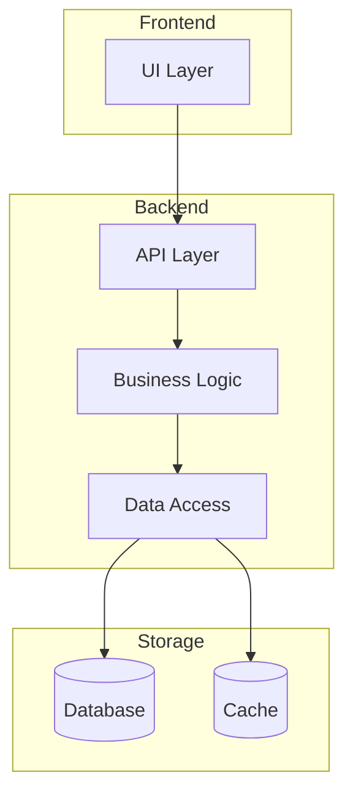
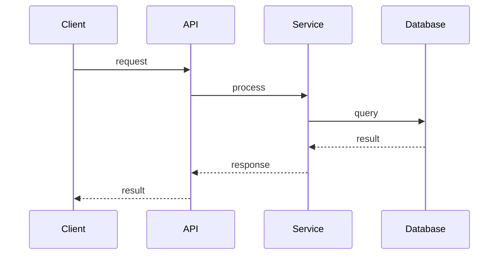
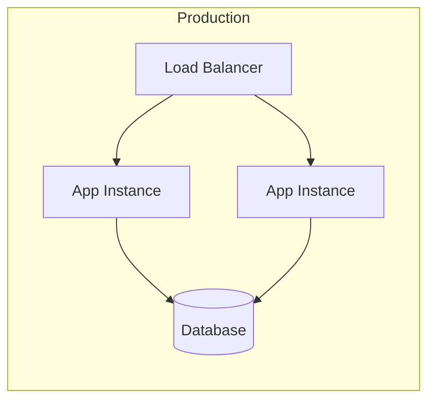

# pydev-workflow: Step 02 — System Architecture

> **Workflow**: pydev-workflow  
> **Step**: 02-system-architecture  
> **Previous**: 01-project-init  
> **Next**: 03-data-models  
> **Output**: `ARCHITECTURE.md` created, `DEV_LOG.md` updated

---

## Pre-Flight

1. **Read CLAUDE.md first** — contains project best practices
2. **Read PROJECT_FOUNDATION.md** — understand project scope and goals
3. **Check DEV_LOG.md** — verify step 01 is complete
4. **Configure git** (if not already):
   ```bash
   git config user.email "isa.lucia.sch@gmail.com"
   git config user.name "luvisaisa"
   ```

---

## Purpose

Define the system's component structure, boundaries, communication patterns, and shared infrastructure. This creates the blueprint that all subsequent design and implementation follows.

---

## 80% Certainty Rule

Execute autonomously when 80%+ certain actions align with project goals.

**Above 80%**: Execute, document decisions made  
**Below 80%**: Stop, explain uncertainty, ask specific questions

---

## Execution

```
[STEP 02] SYSTEM ARCHITECTURE
```

### Phase 1: Analysis

**Actions**:
1. Review PROJECT_FOUNDATION.md for:
   - Core capabilities required
   - Technical stack defined
   - Constraints identified
   - Initial architecture sketch
2. Identify all major components needed
3. Map component responsibilities
4. Identify shared concerns (logging, config, errors)

**80% Certainty Check**:
- Are all core capabilities mapped to components?
- Are component boundaries clear?
- Are communication patterns appropriate for the tech stack?

---

### Phase 2: Component Design

For each component, define:

| Attribute | Description |
|-----------|-------------|
| Name | Clear, descriptive name |
| Responsibility | Single responsibility (what it owns) |
| Boundaries | What it does NOT touch |
| Dependencies | What it needs from other components |
| Dependents | What needs it |
| Interface | How others interact with it |

---

### Phase 3: Communication Patterns

Define how components talk to each other:

| Pattern | Use When |
|---------|----------|
| Sync (direct call) | Immediate response needed, tight coupling acceptable |
| Async (queue/event) | Decoupling needed, eventual consistency OK |
| Request/Response | Client-server interactions |
| Pub/Sub | Multiple consumers, broadcast needed |

---

### Phase 4: Output

**Create `ARCHITECTURE.md`**:

```markdown
# System Architecture

> Last updated: [YYYY-MM-DD]  
> Workflow: pydev-workflow  
> Step: 02-system-architecture

---

## Overview

[One paragraph describing the system architecture approach]

---

## Component Diagram



---

## Components

### [Component Name]

| Attribute | Value |
|-----------|-------|
| Responsibility | [Single responsibility] |
| Boundaries | [What it does not touch] |
| Dependencies | [What it needs] |
| Dependents | [What needs it] |
| Technology | [Implementation tech] |

**Interface**:
```python
# key public methods/endpoints
```

---

## Communication Patterns



| From | To | Method | Format | Notes |
|------|----|--------|--------|-------|
| [Component] | [Component] | [sync/async] | [JSON/etc] | [notes] |

---

## Shared Infrastructure

### Logging

| Aspect | Approach |
|--------|----------|
| Format | [structured/text] |
| Levels | [debug, info, warn, error] |
| Output | [stdout, file, service] |

### Configuration

| Aspect | Approach |
|--------|----------|
| Source | [env vars, config file, etc] |
| Validation | [on startup, runtime] |
| Secrets | [how handled] |

### Error Handling

| Aspect | Approach |
|--------|----------|
| Strategy | [fail fast, graceful degradation] |
| Propagation | [how errors flow] |
| User feedback | [how errors are presented] |

---

## Deployment Architecture



| Unit | Contains | Scaling Strategy |
|------|----------|------------------|
| [Unit name] | [Components] | [Horizontal/Vertical/None] |

---

## Design Decisions

| Decision | Choice | Rationale | Alternatives Considered |
|----------|--------|-----------|------------------------|
| [Area] | [What was chosen] | [Why] | [Other options] |

---

## Next Steps

Proceed to **03-data-models** to define:
- Entity definitions
- Relationships
- Storage strategy
- Query patterns
```

**Update DEV_LOG.md**:

```markdown
### [YYYY-MM-DD] System Architecture Defined {#arch}

**Summary**: Designed system architecture for [Project Name]

**Components Defined**:

| Component | Responsibility |
|-----------|----------------|
| [Name] | [What it does] |

**Architecture Diagram**:

```mermaid
flowchart TD
    [simplified diagram]
```

**Decisions Made**:

| Decision | Rationale |
|----------|-----------|
| [Choice] | [Why] |

**Next Steps**:
- Proceed to data models design

---
```

**Update CLAUDE.md** — Architecture section with new diagram

---

## Commit

```bash
git add ARCHITECTURE.md DEV_LOG.md CLAUDE.md
git commit -m "docs: ARCHITECTURE.md - system architecture defined"
git push origin main
```

---

## Checkpoint

Review architecture with user before proceeding to step 03.

**Questions to confirm**:
1. Are component boundaries correct?
2. Are communication patterns appropriate?
3. Any missing components or concerns?

---

## Output Summary

| Output | Action |
|--------|--------|
| ARCHITECTURE.md | Created with component map, communication patterns, shared infrastructure |
| DEV_LOG.md | Added architecture entry |
| CLAUDE.md | Updated architecture section |
| Git | Committed and pushed |
