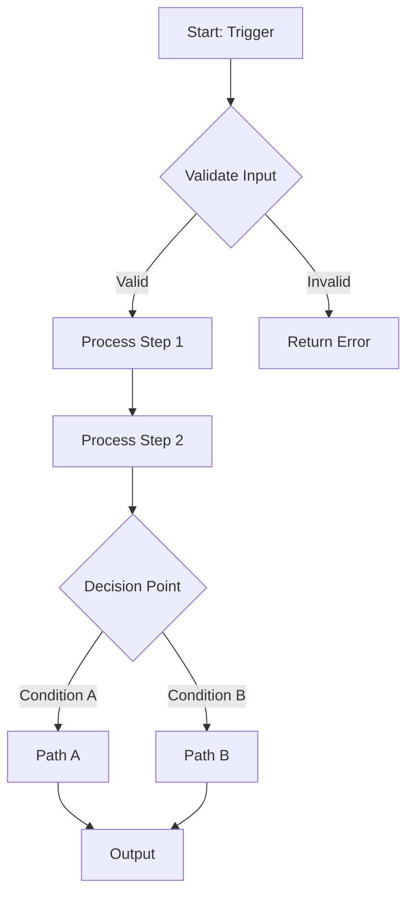
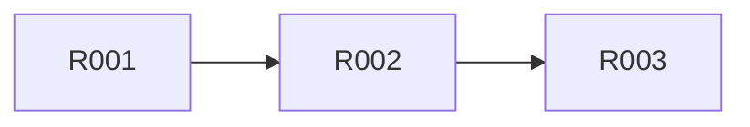
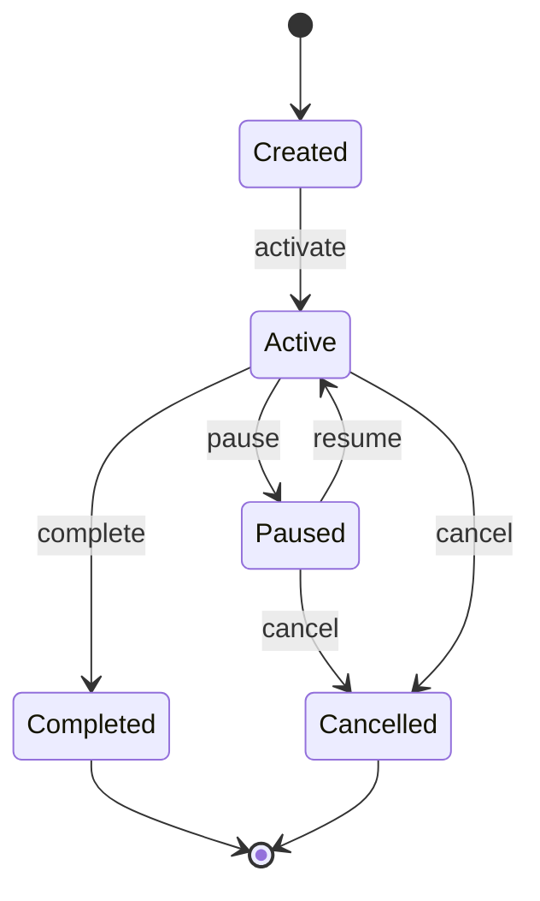

# pydev-workflow: Step 04 — Core Logic Design

> **Workflow**: pydev-workflow  
> **Step**: 04-core-logic  
> **Previous**: 03-data-models  
> **Next**: 05-interfaces  
> **Output**: `ARCHITECTURE.md` updated (Core Logic section), `DEV_LOG.md` updated

---

## Pre-Flight

1. **Read CLAUDE.md** — project best practices
2. **Read ARCHITECTURE.md** — understand components and data models
3. **Check DEV_LOG.md** — verify step 03 is complete

---

## Purpose

Define the algorithms, business rules, processing flows, and state machines that power the system. This is where domain logic lives.

---

## 80% Certainty Rule

**Above 80%**: Execute, document decisions  
**Below 80%**: Stop, ask specific questions

---

## Execution

```
[STEP 04] CORE LOGIC DESIGN
```

### Phase 1: Logic Identification

**Actions**:
1. Review core capabilities from PROJECT_FOUNDATION.md
2. Identify algorithms needed for each capability
3. Define business rules and validation logic
4. Map processing flows end-to-end

**Discovery Questions**:
- What transformations does data undergo?
- What rules govern system behavior?
- What decisions does the system make?
- What sequences of operations exist?

---

### Phase 2: Processing Flow Design

For each major flow:

| Element | Description |
|---------|-------------|
| Trigger | What initiates this flow |
| Input | What data it receives |
| Steps | Sequence of operations |
| Decisions | Branch points and conditions |
| Output | What it produces |
| Errors | What can go wrong |

---

### Phase 3: Business Rules

| Rule Type | Examples |
|-----------|----------|
| Validation | Input must meet criteria X |
| Authorization | User must have permission Y |
| Calculation | Value computed as formula Z |
| Constraint | Cannot exceed limit N |
| Trigger | When X happens, do Y |

---

### Phase 4: Output

**Update `ARCHITECTURE.md`** — Add Core Logic section:

```markdown
## Core Logic

> Last updated: [YYYY-MM-DD]

### Processing Flows

#### [Flow Name]



| Attribute | Value |
|-----------|-------|
| Trigger | [What initiates this] |
| Input | [Data received] |
| Output | [Data produced] |
| Errors | [What can fail] |

**Steps**:

| Step | Action | Error Handling |
|------|--------|----------------|
| 1 | [Validate input] | Return 400 if invalid |
| 2 | [Process data] | Retry on transient failure |
| 3 | [Store result] | Rollback on failure |

---

### Business Rules

#### [Rule Category]

| Rule ID | Condition | Action | Priority |
|---------|-----------|--------|----------|
| R001 | [When this is true] | [Do this] | [1-10] |
| R002 | [When this is true] | [Do this] | [1-10] |

**Rule Dependencies**:



---

### Algorithms

#### [Algorithm Name]

| Attribute | Value |
|-----------|-------|
| Purpose | [What it computes/does] |
| Input | [Parameters] |
| Output | [Return value] |
| Complexity | O([time]) time, O([space]) space |

**Pseudocode**:

```python
def algorithm_name(input: InputType) -> OutputType:
    """
    brief description.
    
    args:
        input: description
    
    returns:
        description
    """
    # step 1: initialize
    result = initialize()
    
    # step 2: process
    for item in input:
        result = process(item, result)
    
    # step 3: finalize
    return finalize(result)
```

**Edge Cases**:

| Case | Handling |
|------|----------|
| Empty input | [Return default / Error] |
| Invalid data | [Validate first / Skip] |
| Overflow | [Cap / Error] |

---

### State Machines

#### [State Machine Name]



| State | Description | Valid Transitions |
|-------|-------------|-------------------|
| Created | Initial state | activate |
| Active | In progress | pause, complete, cancel |
| Paused | Temporarily stopped | resume, cancel |
| Completed | Successfully finished | (terminal) |
| Cancelled | Aborted | (terminal) |

---

### Validation Rules

| Field/Input | Rule | Error Message |
|-------------|------|---------------|
| [field] | [validation] | [message] |

---

### Computed Properties

| Property | Formula/Logic | Cached | Invalidation |
|----------|---------------|--------|--------------|
| [name] | [how computed] | [Yes/No] | [When refreshed] |

---

### Caching Strategy

| Data | Cache Location | TTL | Invalidation Trigger |
|------|----------------|-----|---------------------|
| [what] | [where] | [duration] | [when cleared] |
```

**Update DEV_LOG.md**:

```markdown
### [YYYY-MM-DD] Core Logic Designed {#core-logic}

**Summary**: Designed core logic, algorithms, and business rules

**Processing Flows Defined**:

| Flow | Purpose |
|------|---------|
| [Name] | [What it does] |

**Key Algorithms**:

| Algorithm | Complexity |
|-----------|------------|
| [Name] | O([n]) |

**Business Rules**: [X] rules defined across [Y] categories

**Decisions Made**:

| Decision | Rationale |
|----------|-----------|
| [Choice] | [Why] |

**Next Steps**:
- Proceed to interface design

---
```

---

## Commit

```bash
git add ARCHITECTURE.md DEV_LOG.md
git commit -m "docs: ARCHITECTURE.md - core logic designed"
git push origin main
```

---

## Checkpoint

Review core logic before proceeding.

**Questions to confirm**:
1. Are all processing flows complete?
2. Are business rules comprehensive?
3. Are algorithms efficient enough?
4. Any missing edge cases?

---

## Output Summary

| Output | Action |
|--------|--------|
| ARCHITECTURE.md | Added Core Logic section with flows, rules, algorithms |
| DEV_LOG.md | Added core logic entry |
| Git | Committed and pushed |
