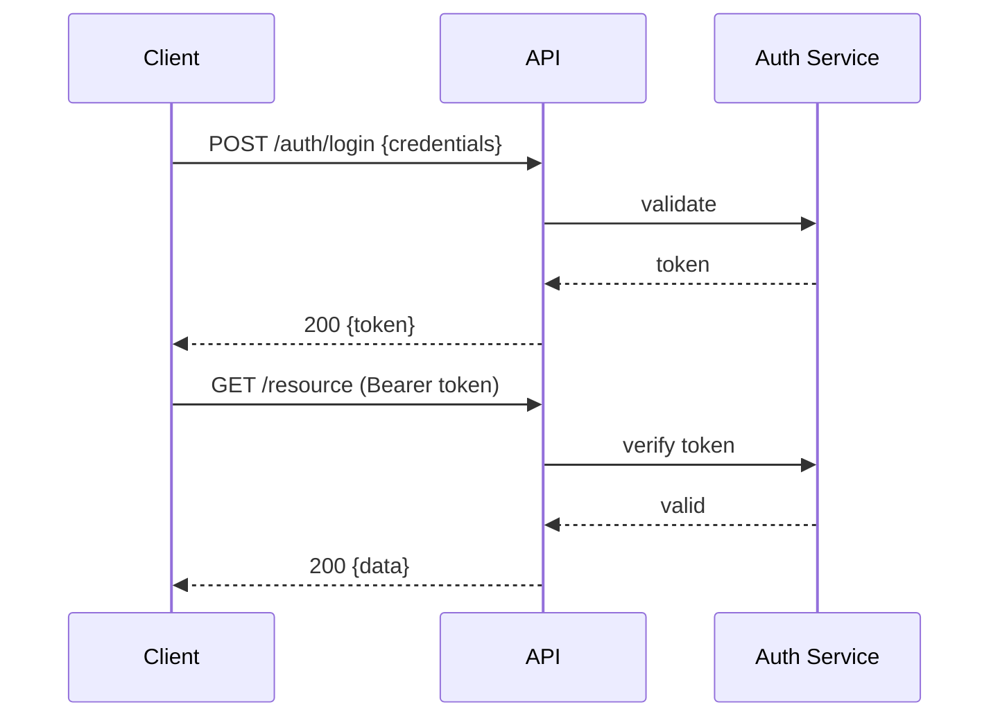
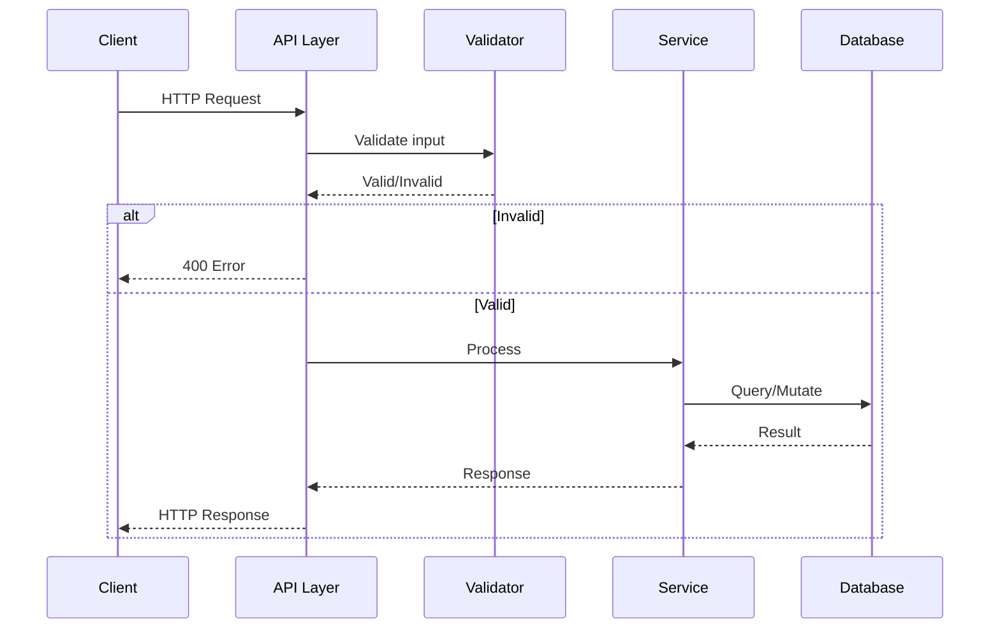

# pydev-workflow: Step 05 — Interface Design

> **Workflow**: pydev-workflow  
> **Step**: 05-interfaces  
> **Previous**: 04-core-logic  
> **Next**: 06-impl-plan  
> **Output**: `ARCHITECTURE.md` updated (Interfaces section), `DEV_LOG.md` updated

---

## Pre-Flight

1. **Read CLAUDE.md** — project best practices
2. **Read ARCHITECTURE.md** — understand components, data models, core logic
3. **Check DEV_LOG.md** — verify step 04 is complete

---

## Purpose

Define all public interfaces: APIs, CLI commands, event contracts, and internal module boundaries. These are the contracts that components agree to honor.

---

## 80% Certainty Rule

**Above 80%**: Execute, document decisions  
**Below 80%**: Stop, ask specific questions

---

## Execution

```
[STEP 05] INTERFACE DESIGN
```

### Phase 1: Interface Identification

**Actions**:
1. Review components from ARCHITECTURE.md
2. Identify all public boundaries
3. List all entry points to the system
4. Define internal module interfaces

**Interface Types**:

| Type | Purpose |
|------|---------|
| REST API | HTTP-based client access |
| GraphQL | Flexible query interface |
| CLI | Command-line access |
| Events | Async communication |
| Internal | Module-to-module contracts |

---

### Phase 2: Contract Design

For each interface:

| Element | Description |
|---------|-------------|
| Endpoint/Command | How to access |
| Input | What it accepts |
| Output | What it returns |
| Errors | What can go wrong |
| Auth | Who can access |

---

### Phase 3: Output

**Update `ARCHITECTURE.md`** — Add Interfaces section:

```markdown
## Interfaces

> Last updated: [YYYY-MM-DD]

### API Overview

| Attribute | Value |
|-----------|-------|
| Style | REST / GraphQL / RPC |
| Base URL | `/api/v1` |
| Auth | Bearer token / API key / None |
| Format | JSON |
| Versioning | URL path / Header |

### Authentication Flow



---

### Endpoints

#### [Resource Group]

##### POST /[resource]

| Attribute | Value |
|-----------|-------|
| Purpose | Create new [resource] |
| Auth | Required |
| Rate Limit | [X] req/min |

**Request**:

```json
{
  "field1": "string (required) - description",
  "field2": "number (optional) - description"
}
```

**Response** `201 Created`:

```json
{
  "id": "uuid",
  "field1": "string",
  "field2": "number",
  "created_at": "ISO8601 timestamp"
}
```

**Errors**:

| Code | Condition | Response |
|------|-----------|----------|
| 400 | Invalid input | `{"error": "validation_error", "details": [...]}` |
| 401 | Not authenticated | `{"error": "unauthorized"}` |
| 409 | Duplicate | `{"error": "conflict", "field": "..."}` |

---

##### GET /[resource]

| Attribute | Value |
|-----------|-------|
| Purpose | List [resources] |
| Auth | Required |
| Pagination | Cursor-based |

**Query Parameters**:

| Param | Type | Default | Description |
|-------|------|---------|-------------|
| limit | int | 20 | Max items (1-100) |
| cursor | string | null | Pagination cursor |
| sort | string | created_at | Sort field |
| order | string | desc | asc/desc |

**Response** `200 OK`:

```json
{
  "data": [...],
  "pagination": {
    "next_cursor": "string or null",
    "has_more": "boolean"
  }
}
```

---

##### GET /[resource]/{id}

| Attribute | Value |
|-----------|-------|
| Purpose | Get single [resource] |
| Auth | Required |

**Response** `200 OK`:

```json
{
  "id": "uuid",
  "field1": "string",
  "...": "..."
}
```

**Errors**:

| Code | Condition |
|------|-----------|
| 404 | Not found |

---

##### PUT /[resource]/{id}

| Attribute | Value |
|-----------|-------|
| Purpose | Update [resource] |
| Auth | Required |

**Request**: (partial update allowed)

```json
{
  "field1": "string (optional)"
}
```

**Response** `200 OK`: Updated resource

---

##### DELETE /[resource]/{id}

| Attribute | Value |
|-----------|-------|
| Purpose | Delete [resource] |
| Auth | Required |

**Response** `204 No Content`

---

### Request/Response Flow



---

### Event Contracts

#### [Event Name]

| Attribute | Value |
|-----------|-------|
| Trigger | [When emitted] |
| Topic/Queue | [destination] |
| Consumers | [Who listens] |

**Payload**:

```json
{
  "event_type": "[event.name]",
  "timestamp": "ISO8601",
  "data": {
    "field": "type"
  }
}
```

---

### CLI Interface

#### [command]

```bash
program [command] [subcommand] [options]
```

| Option | Short | Type | Description |
|--------|-------|------|-------------|
| --option | -o | string | description |
| --flag | -f | bool | description |

**Examples**:

```bash
# example 1
program command --option value

# example 2
program command -f
```

---

### Internal Module Interfaces

#### [Module Name]

```python
class ModuleInterface(Protocol):
    """
    interface for [module] component.
    """
    
    def method_one(self, param: ParamType) -> ReturnType:
        """description of method."""
        ...
    
    def method_two(self, param: ParamType) -> ReturnType:
        """description of method."""
        ...
```

---

### Error Response Format

All errors follow this structure:

```json
{
  "error": "error_code",
  "message": "Human readable message",
  "details": {
    "field": "additional context"
  },
  "request_id": "uuid for tracing"
}
```

| Error Code | HTTP Status | Meaning |
|------------|-------------|---------|
| validation_error | 400 | Invalid input |
| unauthorized | 401 | Auth required |
| forbidden | 403 | Permission denied |
| not_found | 404 | Resource missing |
| conflict | 409 | Duplicate/conflict |
| rate_limited | 429 | Too many requests |
| internal_error | 500 | Server error |
```

**Update DEV_LOG.md**:

```markdown
### [YYYY-MM-DD] Interfaces Designed {#interfaces}

**Summary**: Designed public interfaces and API contracts

**Endpoints Defined**:

| Resource | Endpoints |
|----------|-----------|
| [Resource] | CRUD + [custom] |

**Events Defined**: [X] event types

**CLI Commands**: [Y] commands

**Decisions Made**:

| Decision | Rationale |
|----------|-----------|
| [API style] | [Why] |
| [Auth method] | [Why] |

**Next Steps**:
- Proceed to implementation planning

---
```

---

## Commit

```bash
git add ARCHITECTURE.md DEV_LOG.md
git commit -m "docs: ARCHITECTURE.md - interfaces designed"
git push origin main
```

---

## Checkpoint

Review interfaces before proceeding.

**Questions to confirm**:
1. Are all entry points covered?
2. Are request/response shapes complete?
3. Is error handling consistent?
4. Any missing endpoints?

---

## Output Summary

| Output | Action |
|--------|--------|
| ARCHITECTURE.md | Added Interfaces section with endpoints, events, CLI |
| DEV_LOG.md | Added interfaces entry |
| Git | Committed and pushed |
