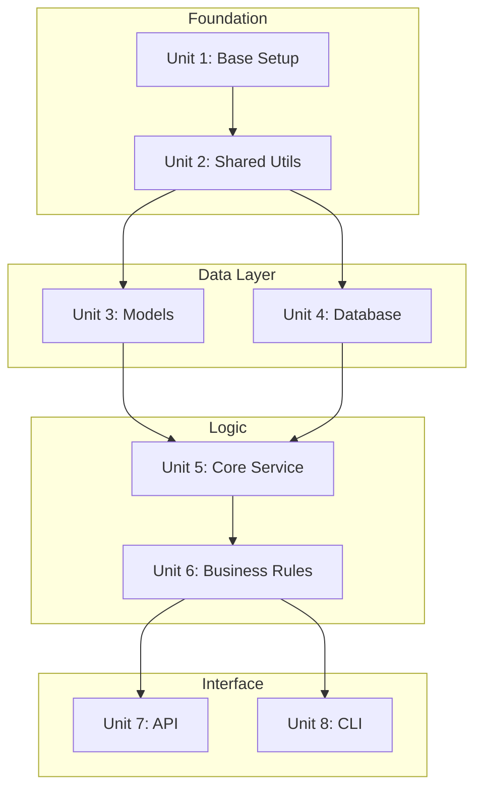
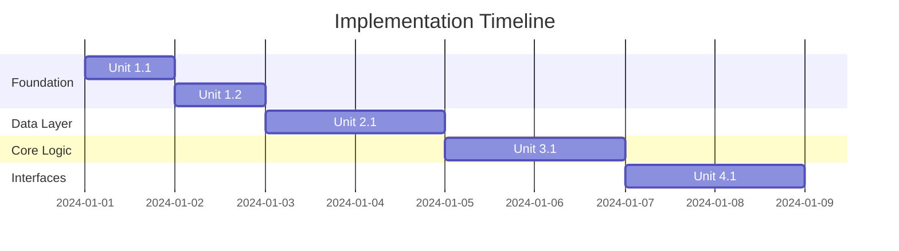

# pydev-workflow: Step 06 — Implementation Plan

> **Workflow**: pydev-workflow  
> **Step**: 06-impl-plan  
> **Previous**: 05-interfaces  
> **Next**: 07-implementation  
> **Output**: `IMPLEMENTATION_PLAN.md` created, `DEV_LOG.md` updated

---

## Pre-Flight

1. **Read CLAUDE.md** — project best practices
2. **Read ARCHITECTURE.md** — full system design
3. **Check DEV_LOG.md** — verify steps 02-05 complete

---

## Purpose

Break the approved architecture into implementation units, sequence them by dependency, and create actionable TODO lists. This is the bridge between design and code.

---

## 80% Certainty Rule

**Above 80%**: Execute, document decisions  
**Below 80%**: Stop, ask specific questions

---

## Execution

```
[STEP 06] IMPLEMENTATION PLAN
```

### Phase 1: Unit Identification

**Actions**:
1. Review all components from ARCHITECTURE.md
2. Break each component into implementable units
3. Identify shared/foundational code
4. Estimate complexity per unit

**Unit Sizing Guidelines**:

| Size | Scope | Time Estimate |
|------|-------|---------------|
| Small | Single function/class | < 1 hour |
| Medium | Module with tests | 1-4 hours |
| Large | Component with integration | 4-8 hours |
| X-Large | Consider splitting | > 8 hours |

---

### Phase 2: Dependency Mapping

For each unit, identify:
- What must exist before this can be built
- What depends on this being complete
- Can this be parallelized with anything

---

### Phase 3: Sequencing

Order units by:
1. Foundation first (shared utilities, base classes)
2. Data layer before business logic
3. Core logic before interfaces
4. Integration last

---

### Phase 4: Output

**Create `IMPLEMENTATION_PLAN.md`**:

```markdown
# Implementation Plan

> Last updated: [YYYY-MM-DD]  
> Workflow: pydev-workflow  
> Step: 06-impl-plan  
> Status: Ready for implementation

---

## Overview

| Metric | Value |
|--------|-------|
| Total Units | [N] |
| Estimated Effort | [X] hours |
| Critical Path | [Units on critical path] |
| Parallelizable | [Units that can run parallel] |

---

## Dependency Graph



---

## Implementation Sequence

### Phase 1: Foundation

#### Unit 1.1: [Unit Name]

| Attribute | Value |
|-----------|-------|
| Priority | 1 |
| Depends On | None |
| Blocks | [Units] |
| Complexity | [Low/Medium/High] |
| Estimate | [X] hours |
| Files | [Expected files to create] |

**TODO**:

* Major Task: [High-level goal]
   * Mid-level Task: [Deliverable]
      * Minor task: [Action]
      * Minor task: [Action]
   * Mid-level Task: [Deliverable]
      * Minor task: [Action]

**Acceptance Criteria**:
- [ ] [Criterion 1]
- [ ] [Criterion 2]
- [ ] Tests pass

---

#### Unit 1.2: [Unit Name]

| Attribute | Value |
|-----------|-------|
| Priority | 2 |
| Depends On | Unit 1.1 |
| Blocks | [Units] |
| Complexity | [Low/Medium/High] |
| Estimate | [X] hours |

**TODO**:

* Major Task: [Goal]
   * Mid-level Task: [Deliverable]
      * Minor task: [Action]

**Acceptance Criteria**:
- [ ] [Criterion]

---

### Phase 2: Data Layer

#### Unit 2.1: [Unit Name]

[Same structure as above]

---

### Phase 3: Core Logic

#### Unit 3.1: [Unit Name]

[Same structure as above]

---

### Phase 4: Interfaces

#### Unit 4.1: [Unit Name]

[Same structure as above]

---

### Phase 5: Integration

#### Unit 5.1: [Unit Name]

[Same structure as above]

---

## Progress Tracking

| Unit | Status | Started | Completed | Notes |
|------|--------|---------|-----------|-------|
| 1.1 | Not Started | | | |
| 1.2 | Not Started | | | |
| 2.1 | Not Started | | | |

**Status Values**: Not Started, In Progress, Blocked, Complete

---

## Risk Register

| Risk | Impact | Likelihood | Mitigation | Owner |
|------|--------|------------|------------|-------|
| [Description] | [H/M/L] | [H/M/L] | [Plan] | [Who] |

---

## Implementation Timeline



---

## File Structure Plan

```
project/
|-- src/
|   |-- [module]/
|   |   |-- __init__.py        # Unit X.X
|   |   |-- [file].py          # Unit X.X
|   |-- [module]/
|       |-- __init__.py        # Unit X.X
|-- tests/
|   |-- [module]/
|       |-- test_[file].py     # Unit X.X tests
|-- [config files]             # Unit 1.1
```

---

## Checkpoints

| After Unit | Checkpoint |
|------------|------------|
| 1.2 | Foundation review |
| 2.1 | Data layer review |
| 3.1 | Core logic review |
| 4.1 | Interface review |
| 5.1 | Integration review |

---

## Next Steps

Begin implementation with **Unit 1.1**. Use pydev-feature workflow for each unit.
```

**Update DEV_LOG.md**:

```markdown
### [YYYY-MM-DD] Implementation Plan Created {#impl-plan}

**Summary**: Created implementation plan with [N] units across [M] phases

**Implementation Phases**:

| Phase | Units | Estimate |
|-------|-------|----------|
| Foundation | [X] | [Y] hrs |
| Data Layer | [X] | [Y] hrs |
| Core Logic | [X] | [Y] hrs |
| Interfaces | [X] | [Y] hrs |
| Integration | [X] | [Y] hrs |

**Critical Path**: [List of blocking units]

**Decisions Made**:

| Decision | Rationale |
|----------|-----------|
| [Sequencing choice] | [Why] |

**Next Steps**:
- Begin implementation with Unit 1.1
- Use pydev-feature workflow for each unit

---
```

**Update CLAUDE.md** — Add Active TODO section with first unit

---

## Commit

```bash
git add IMPLEMENTATION_PLAN.md DEV_LOG.md CLAUDE.md
git commit -m "plan: IMPLEMENTATION_PLAN.md - implementation plan complete"
git push origin main
```

---

## Checkpoint

Review implementation plan before proceeding.

**Questions to confirm**:
1. Are unit sizes appropriate?
2. Is sequencing correct?
3. Are dependencies accurate?
4. Any risks not captured?

---

## Output Summary

| Output | Action |
|--------|--------|
| IMPLEMENTATION_PLAN.md | Created with units, TODOs, timeline |
| DEV_LOG.md | Added implementation plan entry |
| CLAUDE.md | Updated with first TODO |
| Git | Committed and pushed |
