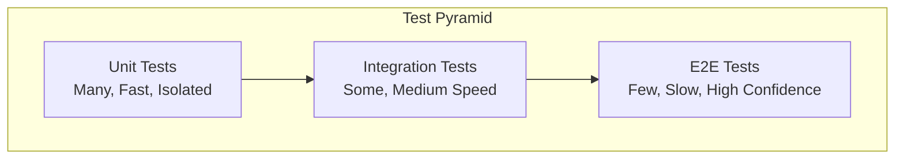
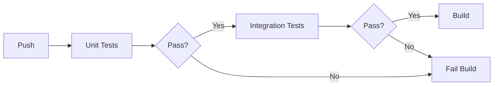

# pydev-workflow: Step 08 — Test Strategy

> **Workflow**: pydev-workflow  
> **Step**: 08-test-strategy  
> **Previous**: 07-implementation  
> **Next**: 09-test-impl  
> **Output**: `TEST_STRATEGY.md` created, `DEV_LOG.md` updated

---

## Pre-Flight

1. **Read CLAUDE.md** — project best practices
2. **Read ARCHITECTURE.md** — understand system structure
3. **Review implementation** — understand what was built
4. **Check DEV_LOG.md** — verify step 07 complete

---

## Purpose

Define the testing approach, coverage targets, test categories, and test data strategy. This ensures systematic quality assurance.

---

## 80% Certainty Rule

**Above 80%**: Execute, document decisions  
**Below 80%**: Stop, ask specific questions

---

## Execution

```
[STEP 08] TEST STRATEGY
```

### Phase 1: Coverage Analysis

**Actions**:
1. Identify all testable components
2. Assess risk level per component
3. Set coverage targets based on risk
4. Identify critical paths requiring thorough testing

**Risk-Based Coverage**:

| Risk Level | Coverage Target | Examples |
|------------|-----------------|----------|
| Critical | 90%+ | Auth, payments, data integrity |
| High | 80%+ | Core business logic |
| Medium | 70%+ | Standard CRUD, utilities |
| Low | 50%+ | Simple helpers, config |

---

### Phase 2: Test Categories

| Category | Purpose | Scope | Speed |
|----------|---------|-------|-------|
| Unit | Test isolated functions/classes | Single unit | Fast |
| Integration | Test component interactions | Multiple units | Medium |
| E2E | Test full user flows | Entire system | Slow |
| Performance | Test speed/load | Critical paths | Varies |

---

### Phase 3: Output

**Create `TEST_STRATEGY.md`**:

```markdown
# Test Strategy

> Last updated: [YYYY-MM-DD]  
> Workflow: pydev-workflow  
> Step: 08-test-strategy

---

## Overview

| Metric | Target |
|--------|--------|
| Overall Coverage | [X]% |
| Unit Test Coverage | [X]% |
| Integration Coverage | [X]% |
| Critical Path Coverage | 100% |

---

## Test Pyramid



| Layer | Count | Run Time | Run Frequency |
|-------|-------|----------|---------------|
| Unit | [Many] | [Fast] | Every commit |
| Integration | [Some] | [Medium] | Every PR |
| E2E | [Few] | [Slow] | Before release |

---

## Coverage Targets by Component

| Component | Risk | Target | Rationale |
|-----------|------|--------|-----------|
| [Component] | Critical | 90% | [Why] |
| [Component] | High | 80% | [Why] |
| [Component] | Medium | 70% | [Why] |

---

## Test Categories

### Unit Tests

| Aspect | Approach |
|--------|----------|
| Scope | Single function/class |
| Dependencies | Mocked |
| Database | Not used |
| Network | Not used |
| Location | `tests/unit/` |
| Naming | `test_[module]_[scenario].py` |

**What to test**:
- Pure functions
- Class methods
- Input validation
- Edge cases
- Error conditions

**What NOT to test**:
- External libraries
- Simple getters/setters
- Framework code

---

### Integration Tests

| Aspect | Approach |
|--------|----------|
| Scope | Multiple components |
| Dependencies | Real or test doubles |
| Database | Test database |
| Network | Mocked external, real internal |
| Location | `tests/integration/` |
| Naming | `test_[flow]_integration.py` |

**What to test**:
- API endpoints
- Database operations
- Service interactions
- Message flows

---

### End-to-End Tests

| Aspect | Approach |
|--------|----------|
| Scope | Full system |
| Dependencies | Real |
| Database | Test database |
| Network | Real |
| Location | `tests/e2e/` |
| Naming | `test_[user_flow]_e2e.py` |

**Critical Paths to Cover**:

| Flow | Priority | Description |
|------|----------|-------------|
| [Flow 1] | P0 | [User journey] |
| [Flow 2] | P1 | [User journey] |

---

## Test Data Strategy

| Aspect | Approach |
|--------|----------|
| Generation | [Factories / Fixtures / Builders] |
| Storage | [In-memory / Test DB / Files] |
| Cleanup | [Transaction rollback / Truncate / Reset] |
| Sensitive Data | [Anonymized / Synthetic] |

### Fixtures

```python
# example fixture structure
@pytest.fixture
def sample_user():
    return User(
        id=uuid4(),
        email="test@example.com",
        name="Test User"
    )
```

### Factories

```python
# example factory pattern
class UserFactory:
    @staticmethod
    def create(**overrides) -> User:
        defaults = {
            "id": uuid4(),
            "email": f"user-{uuid4()}@test.com",
            "name": "Test User"
        }
        return User(**{**defaults, **overrides})
```

---

## Test Environment

| Environment | Purpose | Database | External Services |
|-------------|---------|----------|-------------------|
| Local | Development | SQLite / Docker | Mocked |
| CI | Automated | Docker | Mocked |
| Staging | Pre-prod | Real (copy) | Sandbox |

### Environment Setup

```bash
# local test setup
[commands to set up test environment]

# run tests
[commands to run tests]
```

---

## Mocking Strategy

| Dependency | Mock Approach |
|------------|---------------|
| Database | [Test DB / In-memory] |
| External APIs | [Mock server / Recorded responses] |
| Time | [Freeze time] |
| Randomness | [Seed / Fixed values] |
| File system | [Temp directory / Virtual] |

---

## Test Organization

```
tests/
|-- conftest.py              # shared fixtures
|-- unit/
|   |-- [module]/
|       |-- test_[file].py
|-- integration/
|   |-- test_[flow].py
|-- e2e/
|   |-- test_[journey].py
|-- fixtures/
|   |-- [data files]
|-- factories/
|   |-- [factory files]
```

---

## CI/CD Integration



| Stage | Tests Run | Timeout | Failure Action |
|-------|-----------|---------|----------------|
| Pre-commit | Unit (fast) | 30s | Block commit |
| PR | Unit + Integration | 5min | Block merge |
| Main | All | 15min | Alert |
| Release | All + E2E | 30min | Block release |

---

## Quality Gates

| Gate | Requirement | Enforced |
|------|-------------|----------|
| Coverage | >= [X]% | CI |
| Unit tests | 100% pass | CI |
| Integration | 100% pass | CI |
| No new bugs | Zero regressions | CI |

---

## Performance Testing (if applicable)

| Test | Target | Tool |
|------|--------|------|
| Response time | < [X]ms p95 | [tool] |
| Throughput | > [X] req/s | [tool] |
| Memory | < [X]MB | [tool] |

---

## Test Documentation

Each test should include:
- Clear name describing scenario
- Docstring explaining purpose
- Arrange/Act/Assert structure
- Comments only for non-obvious logic (lowercase, no emojis)

```python
def test_user_creation_with_valid_data_succeeds():
    """
    verify that creating a user with valid data returns the created user.
    """
    # arrange
    user_data = {"email": "test@example.com", "name": "Test"}
    
    # act
    result = create_user(user_data)
    
    # assert
    assert result.email == user_data["email"]
```

---

## Next Steps

Proceed to **09-test-impl** to implement tests following this strategy.
```

**Update DEV_LOG.md**:

```markdown
### [YYYY-MM-DD] Test Strategy Defined {#test-strategy}

**Summary**: Defined testing approach and coverage targets

**Coverage Targets**:

| Category | Target |
|----------|--------|
| Overall | [X]% |
| Unit | [X]% |
| Integration | [X]% |

**Test Categories**: Unit, Integration, E2E

**Decisions Made**:

| Decision | Rationale |
|----------|-----------|
| [Testing framework] | [Why] |
| [Mock strategy] | [Why] |

**Next Steps**:
- Implement tests following strategy

---
```

---

## Commit

```bash
git add TEST_STRATEGY.md DEV_LOG.md
git commit -m "docs: TEST_STRATEGY.md - test strategy defined"
git push origin main
```

---

## Checkpoint

Review test strategy before implementation.

**Questions to confirm**:
1. Are coverage targets appropriate?
2. Is test data strategy clear?
3. Are critical paths identified?
4. Is CI integration defined?

---

## Output Summary

| Output | Action |
|--------|--------|
| TEST_STRATEGY.md | Created with coverage targets, categories, data strategy |
| DEV_LOG.md | Added test strategy entry |
| Git | Committed and pushed |
