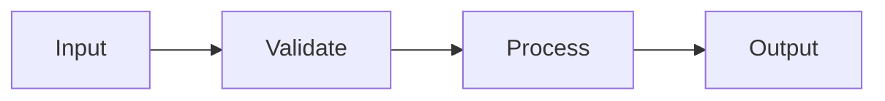

# pydev-feature: Feature Implementation Workflow

> **Workflow**: pydev-feature  
> **Purpose**: Implement specific features within an existing project  
> **Trigger**: TODO list generated during pydev-workflow, or standalone feature request

---

## Pre-Flight

1. **Read CLAUDE.md first** — contains project best practices
2. **Check existing docs**:
   ```bash
   ls -la CLAUDE.md PROJECT_FOUNDATION.md ARCHITECTURE.md IMPLEMENTATION_PLAN.md DEV_LOG.md 2>/dev/null
   ```
3. **Check parent workflow status**:
   - If IMPLEMENTATION_PLAN.md exists, check current step/section
   - Update progress tracking when feature completes
   - This ensures pydev-workflow stays in sync with pydev-feature work
4. **Configure git** (if not already):
   ```bash
   git config user.email "isa.lucia.sch@gmail.com"
   git config user.name "luvisaisa"
   ```

---

## TODO List Format

When generating or receiving a TODO list, use this structure:

```markdown
## TODO: [Feature/Component Name]

Refs: IMPLEMENTATION_PLAN.md Section [X.X]

* Major Task: [High-level goal]
   * Mid-level Task: [Concrete deliverable]
      * Minor task: [Specific action]
      * Minor task: [Specific action]
   * Mid-level Task: [Concrete deliverable]
      * Minor task: [Specific action]
```

| Level | Scope | Commit Trigger |
|-------|-------|----------------|
| Major Task | Feature or component | Commit after all mid-level tasks complete |
| Mid-level Task | Concrete deliverable | Commit after completion |
| Minor Task | Specific action | Part of mid-level commit |

---

## 80% Certainty Rule

Execute autonomously when 80%+ certain actions align with project goals.

**Above 80%**: Execute, document decisions made  
**Below 80%**: Stop, explain uncertainty, ask specific questions

---

## Step 01: Task Analysis

```
[STEP 1/6] TASK ANALYSIS
```

**Purpose**: Understand scope, map dependencies, identify risks

**Actions**:
1. Parse TODO into discrete work units
2. Identify files to create/modify
3. Map dependencies
4. Identify risks and edge cases
5. Verify alignment with existing architecture (check ARCHITECTURE.md)

**80% Certainty Check**:
- Do I understand what needs to be built?
- Do I know where it fits in the codebase?
- Are dependencies clear?
- Are edge cases identified?

If any answer uncertain, ask before proceeding.

**Output** (inline for simple features, document for complex):

```markdown
## Task Analysis: [Feature Name]

> Refs: IMPLEMENTATION_PLAN.md Section [X.X]

### Scope

[What needs to be built]

### Files Affected

| File | Action | Reason |
|------|--------|--------|
| [path/to/file.py] | CREATE | [why] |
| [path/to/other.py] | MODIFY | [why] |

### Dependencies

| Dependency | Status | Notes |
|------------|--------|-------|
| [Component/module] | Exists / Needs creation | [notes] |

### Risks and Edge Cases

| Risk/Edge Case | Impact | Mitigation |
|----------------|--------|------------|
| [Description] | [High/Med/Low] | [How to handle] |

### Implementation Sequence

1. [First thing to build]
2. [Second thing]
3. [Third thing]
```

**Checkpoint**: Only if below 80% certainty  
**Commit**: `docs: task analysis for [feature]` (if separate document created)

---

## Step 02: Feature Design

```
[STEP 2/6] FEATURE DESIGN
```

**Purpose**: Plan implementation approach before writing code

**Actions**:
1. Design component structure
2. Define function/class signatures
3. Plan error handling approach
4. Identify test scenarios
5. Verify consistency with existing patterns (check CLAUDE.md)

**80% Certainty Check**:
- Is design consistent with existing architecture?
- Are interfaces clear and complete?
- Is error handling comprehensive?

**Output** (inline for simple, document for complex):

```markdown
## Feature Design: [Feature Name]

> Last updated: [YYYY-MM-DD]

### Approach

[High-level implementation strategy]

### Components

#### [Component/Function Name]

| Attribute | Value |
|-----------|-------|
| Purpose | [What it does] |
| Location | [File path] |
| Dependencies | [What it needs] |
| Error handling | [Approach] |

**Interface**:
```python
def function_name(param: Type, other: Type) -> ReturnType:
    """
    brief description of what this does.
    
    args:
        param: description
        other: description
    
    returns:
        description
    
    raises:
        ErrorType: when this happens
    """
```

### Data Flow



### Test Scenarios

| Scenario | Input | Expected Output |
|----------|-------|-----------------|
| Happy path | [input] | [output] |
| Edge case | [input] | [output] |
| Error case | [input] | [error] |
```

**Checkpoint**: Only if below 80% certainty or design is complex  
**Commit**: `docs: feature design for [feature]` (if separate document created)

---

## Step 03: Implementation

```
[STEP 3/6] IMPLEMENTATION
```

**Purpose**: Write the code following the design

**Actions**:
1. Implement each work unit in sequence per TODO
2. Follow existing code patterns (check CLAUDE.md)
3. Add docstrings and comments (lowercase, no emojis)
4. Commit after each mid-level task completion

**Progress Format**:
```
[IMPL] path/to/file.py
  Action: CREATE
  Status: COMPLETE
  Summary: implemented [what was done]

[IMPL] path/to/other.py
  Action: MODIFY
  Status: COMPLETE
  Summary: added [what was added]
```

**Comment Style** (always lowercase, no emojis):
```python
# validate input before processing
def process_data(input: DataType) -> Result:
    """
    process the input data and return result.
    
    args:
        input: the data to process
    
    returns:
        processed result
    """
    # check for empty input
    if not input:
        return None
    
    # transform and return
    return transform(input)
```

**Commit after each mid-level task**:
```bash
git add [files]
git commit -m "feat: [component] - [what was implemented]"
```

**Push after each major task**:
```bash
git push origin main
```

---

## Step 04: Testing

```
[STEP 4/6] TESTING
```

**Purpose**: Write and run tests for the implementation

**Actions**:
1. Write tests for each component (following TEST_STRATEGY.md if exists)
2. Run tests
3. Fix failures (up to 3 auto-retry attempts)
4. Verify coverage is acceptable

**Test Output Format**:
```
[TEST] [component]

test_happy_path ........................ PASS
test_edge_case ......................... PASS  
test_error_handling .................... PASS
test_integration ....................... PASS

----------------------------------------
SUMMARY: 4 passed / 0 failed / 0 skipped
----------------------------------------

Coverage: [X]% lines, [Y]% branches
```

**If failures occur**:
```
[TEST] [component]

test_happy_path ........................ PASS
test_edge_case ......................... FAIL
  Expected: [expected value]
  Actual: [actual value]
  
[FIX ATTEMPT 1/3]
  Analysis: [what went wrong]
  Fix: [what was changed]
  
[RETRY] test_edge_case ................. PASS

----------------------------------------
SUMMARY: 4 passed / 0 failed / 0 skipped
----------------------------------------
```

**If failures persist after 3 attempts**: Stop, report issue, ask for guidance

**Commit**:
```bash
git add tests/
git commit -m "test: [component] - [what was tested]"
git push origin main
```

---

## Step 05: Integration

```
[STEP 5/6] INTEGRATION
```

**Purpose**: Connect new code to existing system

**Actions**:
1. Update imports and module wiring
2. Connect to existing components per ARCHITECTURE.md
3. Run broader test suite for regression check
4. Verify feature works in full system context

**Output Format**:
```
[INTEGRATION] [feature]

Connections made:
| From | To | How |
|------|-----|-----|
| [new component] | [existing component] | [import/call/event] |

Updated files:
| File | Change |
|------|--------|
| [path] | [what was updated] |

Regression check:
  Running full test suite...
  
  ----------------------------------------
  SUMMARY: [X] passed / [Y] failed / [Z] skipped
  ----------------------------------------
  
  [If failures, list and explain]
```

**Commit**:
```bash
git add .
git commit -m "feat: integrate [feature] with [system component]"
git push origin main
```

---

## Step 06: Cleanup and Documentation

```
[STEP 6/6] CLEANUP AND DOCUMENTATION
```

**Purpose**: Polish code and update documentation

**Actions**:
1. Review code for clarity (refactor if needed, small improvements only)
2. Ensure all docstrings are complete (lowercase comments)
3. Update ARCHITECTURE.md if new components added (timestamped)
4. Add entry to DEV_LOG.md with implementation summary
5. Update IMPLEMENTATION_PLAN.md progress (if part of active pydev-workflow)
6. Final lint/format pass

**Do not create new documentation files** — update existing ones. Ask before creating new docs.

**Update ARCHITECTURE.md** (if architecture changed):
```markdown
## [Relevant Section]

> Last updated: [YYYY-MM-DD]

[Add new component/flow documentation using mermaid diagrams]
```

**Add DEV_LOG.md entry**:
```markdown
### [YYYY-MM-DD] [Feature Name] Implemented {#feature-id}

**Summary**: [What was accomplished]

**Changes**:

| Component | Change |
|-----------|--------|
| [component] | [what changed] |

**Files Added/Modified**:

| File | Action | Purpose |
|------|--------|---------|
| [path] | CREATE/MODIFY | [why] |

**Decisions Made**:

| Decision | Rationale |
|----------|-----------|
| [decision] | [why] |

**Test Coverage**: [X]% lines

**Next Steps**:
- [Follow-up tasks if any]

---
```

**Update CLAUDE.md** (if best practices changed):
```markdown
## Recent Decisions

| Date | Decision | Rationale |
|------|----------|-----------|
| [YYYY-MM-DD] | [new decision] | [why] |
```

**Final Output**:
```
[CLEANUP] [feature]

Refactoring: [changes made or "none needed"]

Documentation updated:
| Document | Section | Change |
|----------|---------|--------|
| ARCHITECTURE.md | [section] | [what was added] |
| DEV_LOG.md | Entries | Added implementation summary |
| CLAUDE.md | Recent Decisions | [if updated] |

Lint/format: PASS

Feature complete.
```

**Final Commit**:
```bash
git add .
git commit -m "docs: [feature] implementation complete - dev log updated"
git push origin main
```

---

## Entry Points

pydev-feature can start at different steps depending on context:

| Starting Point | When to Use |
|----------------|-------------|
| Step 01 (Task Analysis) | New feature, unclear scope |
| Step 02 (Design) | Scope clear, need to plan implementation |
| Step 03 (Implementation) | Design provided/approved, ready to code |
| Step 04 (Testing) | Code exists, needs tests |
| Step 05 (Integration) | Tested code needs to be connected |
| Step 06 (Cleanup) | Working feature needs polish |

**Trigger phrases**:
- "Implement [feature]" -> Start at Step 01
- "Here's the design, implement it" -> Start at Step 03
- "Add tests for [component]" -> Start at Step 04
- "Clean up and document [feature]" -> Start at Step 06

---

## Quick Reference

### Git Config
```bash
git config user.email "isa.lucia.sch@gmail.com"
git config user.name "luvisaisa"
```

### Commit Types
| Type | Use For |
|------|---------|
| `feat:` | New feature implementation |
| `fix:` | Bug fix |
| `test:` | Test changes |
| `refactor:` | Code refactoring |
| `docs:` | Documentation changes |

### Comment Rules
- always lowercase
- never use emojis
- be concise and clear

### Documentation Rules
- update existing files, do not create new ones without asking
- use mermaid.js for all diagrams
- timestamp all documentation updates
- log all implementations in DEV_LOG.md

### 80% Rule
- Above 80% certain: Execute, document decisions
- Below 80% certain: Stop, ask specific questions

---

## Workflow Metadata

```yaml
workflow:
  name: pydev-feature
  version: 1.0
  
steps:
  - id: 01-task-analysis
    name: Task Analysis
    checkpoint: conditional (below 80% certainty)
    
  - id: 02-design
    name: Feature Design
    checkpoint: conditional (below 80% certainty or complex)
    
  - id: 03-implementation
    name: Implementation
    checkpoint: none (commit per mid-level task)
    
  - id: 04-testing
    name: Testing
    checkpoint: on persistent failures
    
  - id: 05-integration
    name: Integration
    checkpoint: none
    
  - id: 06-cleanup
    name: Cleanup and Documentation
    checkpoint: none

triggers:
  - TODO list generated
  - "implement [feature]" request
  - pydev-workflow step 07

outputs:
  - source files
  - test files
  - updated ARCHITECTURE.md (if needed)
  - DEV_LOG.md entry
  - git commits
```
