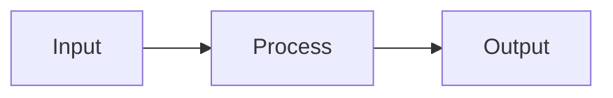

# CLAUDE.md Template

> Copy this template when initializing a new project's CLAUDE.md  
> This file is read first before any work begins — it contains project best practices

---

```markdown
# [Project Name]

> Last updated: [YYYY-MM-DD]

## Overview

[One paragraph summary of what this project does, why it exists, and its current state]

---

## Best Practices

### Code Style

| Rule | Description |
|------|-------------|
| Comments | always lowercase, no emojis |
| Docstrings | required for all public functions |
| Line length | [max characters] |
| Formatting | [tool, e.g., black, prettier] |

### Naming Conventions

| Type | Convention | Example |
|------|------------|---------|
| Files | [snake_case/kebab-case] | `user_service.py` |
| Classes | [PascalCase] | `UserService` |
| Functions | [snake_case] | `get_user_by_id` |
| Constants | [UPPER_SNAKE] | `MAX_RETRIES` |
| Variables | [snake_case] | `user_count` |

### Documentation

| Rule | Description |
|------|-------------|
| New files | update existing docs, do not create new ones without evaluation |
| Diagrams | use mermaid.js for all visuals |
| Timestamps | all documentation changes must be timestamped |
| Dev log | log all implementations in DEV_LOG.md |

### Git

| Rule | Description |
|------|-------------|
| User | luvisaisa |
| Email | isa.lucia.sch@gmail.com |
| Branch | main (unless specified) |
| Commits | frequent and meaningful |
| Push | after every major task |

### Commit Message Format

```
<type>: <component> - <short description>

<optional body explaining why>

Refs: <relevant doc or issue>
```

**Types**: `feat`, `fix`, `test`, `refactor`, `docs`, `config`

---

## Current Status

| Field | Value |
|-------|-------|
| Workflow | pydev-workflow / pydev-feature |
| Current Step | [step ID] |
| Next Step | [step ID] |
| Last Updated | [YYYY-MM-DD] |

---

## Architecture

```mermaid
flowchart TD
    subgraph [Layer]
        A[Component]
    end
    subgraph [Layer]
        B[Component]
    end
    A --> B
```

### Key Components

| Component | Purpose | Location |
|-----------|---------|----------|
| [Name] | [What it does] | [path/] |

### Data Flow



---

## Project Structure

```
project/
|-- src/                  # source code
|-- tests/                # test files
|-- docs/                 # additional documentation (if needed)
|-- CLAUDE.md             # this file
|-- PROJECT_FOUNDATION.md # project definition
|-- ARCHITECTURE.md       # system design
|-- IMPLEMENTATION_PLAN.md # build sequence
|-- DEV_LOG.md            # development timeline
|-- TEST_STRATEGY.md      # testing approach
|-- README.md             # user documentation
```

---

## Dependencies

| Package | Version | Purpose |
|---------|---------|---------|
| [name] | [version] | [why needed] |

---

## Environment

### Setup

```bash
# commands to set up development environment
```

### Running

```bash
# commands to run the project
```

### Testing

```bash
# commands to run tests
```

---

## Recent Decisions

| Date | Decision | Rationale |
|------|----------|-----------|
| [YYYY-MM-DD] | [What was decided] | [Why] |

---

## Active TODO

> Current work in progress (if mid-implementation)

```markdown
## TODO: [Feature Name]

Refs: IMPLEMENTATION_PLAN.md Section [X.X]

* Major Task: [goal]
   * Mid-level Task: [deliverable]
      * Minor task: [action] -- DONE
      * Minor task: [action] -- IN PROGRESS
      * Minor task: [action] -- PENDING
```

---

## Common Commands

| Command | Description |
|---------|-------------|
| `[command]` | [what it does] |

---

## Known Issues

| Issue | Severity | Workaround |
|-------|----------|------------|
| [Description] | [High/Med/Low] | [How to work around] |

---

## Resources

| Resource | Link |
|----------|------|
| [Documentation] | [url] |
| [Related project] | [url] |
```

---

## Minimal Version

For simpler projects, use this condensed version:

```markdown
# [Project Name]

## Overview
[One paragraph summary]

## Best Practices
- comments always lowercase, no emojis
- use mermaid.js for diagrams
- update existing docs, do not create new ones without asking
- log all work in DEV_LOG.md

## Git
- user: luvisaisa
- email: isa.lucia.sch@gmail.com

## Status
| Field | Value |
|-------|-------|
| Current Step | [step] |
| Last Updated | [date] |

## Architecture
```mermaid
flowchart TD
    [diagram]
```

## Recent Decisions
| Date | Decision | Rationale |
|------|----------|-----------|
| [date] | [decision] | [why] |
```
